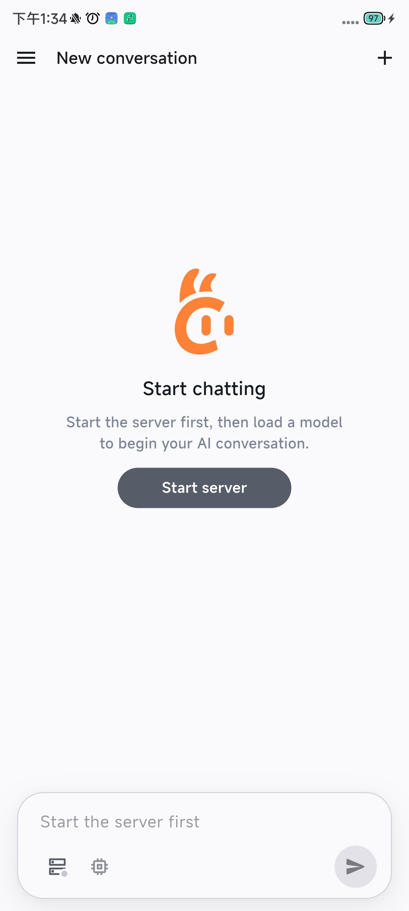
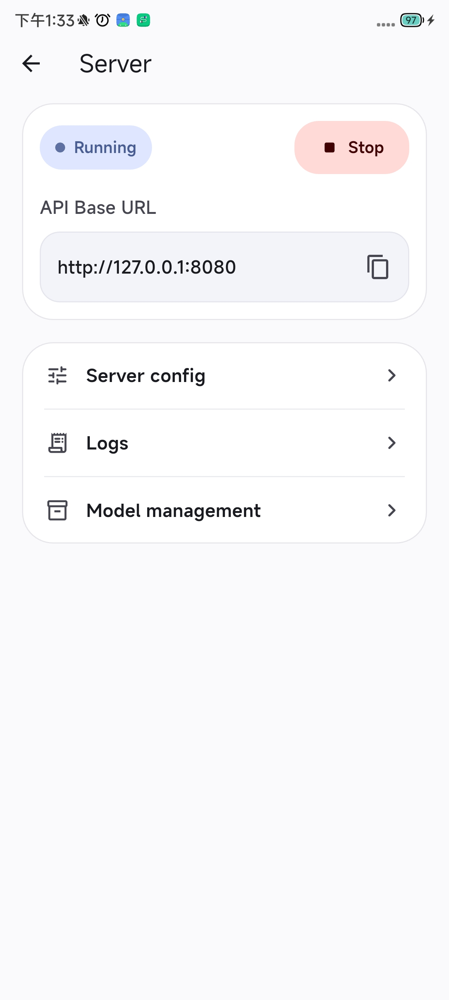
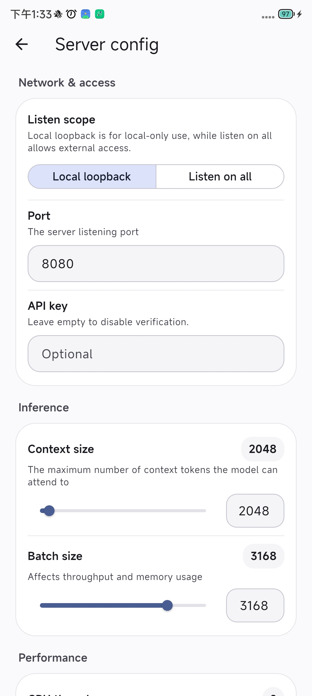
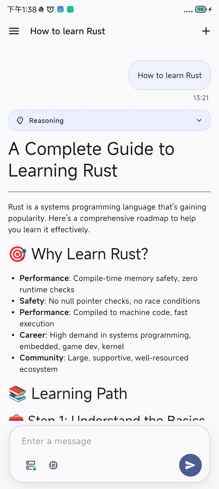

  
  <h1>ServLlama</h1>
  
Powerful LLM Server On Your Phone

  <strong>English</strong> |
  <a href="./README_ZH.md">中文</a>

  <table>
    <tr>
      <td></td>
      <td></td>
      <td></td>
      <td></td>
    </tr>
  </table>

## 📖 Introduction

ServLlama is an app that turns your Android phone into a local LLM serving device without Termux. It provides a user-friendly interface for model file management, server process control, runtime parameter configuration, log viewing, and chat interaction. It also includes a Web UI so users can talk to the model directly in a browser.

At its core, ServLlama runs a cross-compiled `llama-server` directly on Android, which are the same `llama-server` you use in Termux.

## ✨ Highlights

- 🦙 Server management: Start and stop the local LLM server in-app, and inspect status and logs.
- 🔌 API support: Powered by `llama-server`, exposing OpenAI-compatible and Anthropic-compatible APIs.
- 🌐 Web UI: Access the built-in Web UI from a browser once the server is running.
- 🧠 Model management: Import, host, and delete local `GGUF` models, with support for loading, switching, and unloading.
- 💬 Chat experience: Streaming responses, collapsible reasoning content, code block rendering, and session history management.
- ⚙️ Runtime configuration: Visually configure host, port, API key, context size, thread count, and other key parameters.
- 🎨 Theme support: Switch between light, dark, and follow-system appearance modes.
- 🌍 Internationalization: Switch between Chinese and English in-app.

## 🚀 How to Use

1. Download a `GGUF` model from [Hugging Face](https://huggingface.co/) and pick a mobile-friendly quantized file such as `Q4_K_M`.
2. Open ServLlama, go to Model Management, and import the downloaded `GGUF` file into the app.
3. Open the Server page and adjust basics like port, context size, or thread count if needed.
4. Start the local server and wait until the status shows ready.
5. Open the Chat page or Web UI, choose a model, send your first prompt, and begin chatting.

You can also copy the ServLlama server base URL into other AI client apps such as Kelivo, RikkaHub, and ChatterUI, use your imagination!

## 📚 Related Docs

- [`llama-server-README.md`](llama-server-README.md): Detailed usage notes and parameter reference for `llama-server`.

## 🙏 Acknowledgements

- [`llama.cpp`](https://github.com/ggml-org/llama.cpp): The core capabilities of this app are powered by `llama.cpp`.
