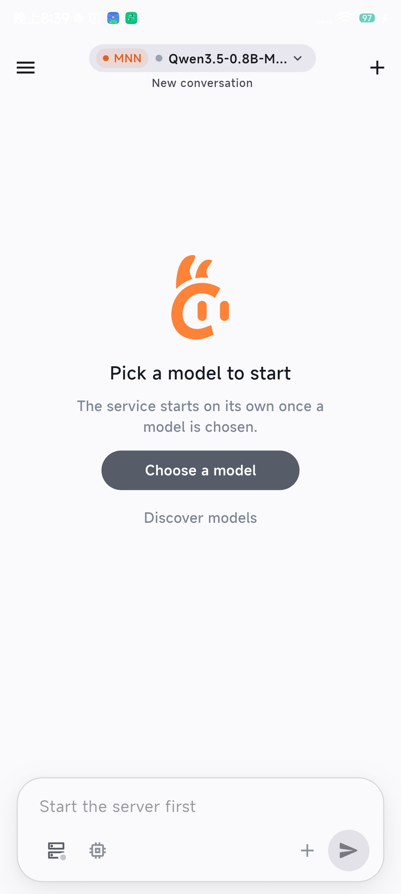
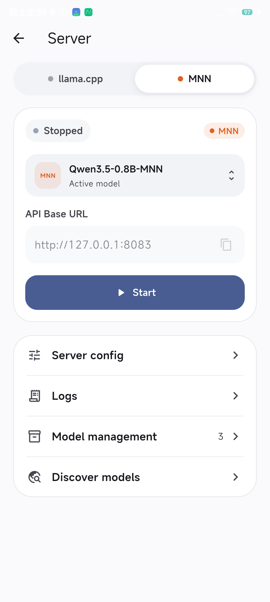
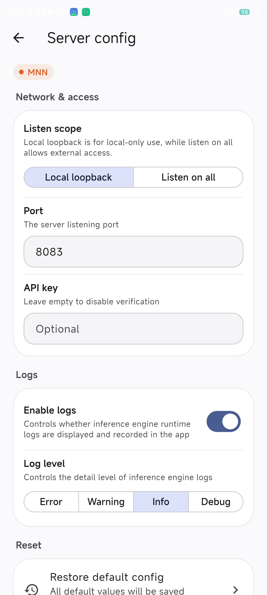
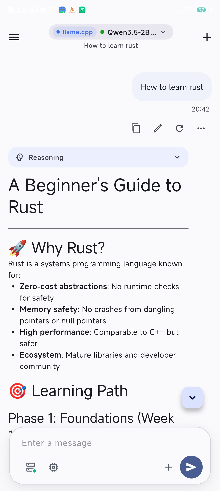

<div align="center">
  
  <h1>ServLlama</h1>
  <p><strong>一键让你的手机变成强大的本地大模型服务器</strong></p>

  <p>
    <a href="https://github.com/ArkaneFans/Servllama/releases/latest">
      
    </a>
  </p>

<p align="center">
  <a href="./README.md">English</a> |
  <strong>中文</strong>
</p>

<p align="center">
  <table>
    <tr>
      <td></td>
      <td></td>
      <td></td>
      <td></td>
    </tr>
  </table>
</p>

</div>

## 项目简介

ServLlama 可以将你的 Android 设备变成一台独立运行的本地大模型服务器，在一个应用中完成模型发现与下载、切换 llama.cpp 或 MNN 推理引擎、服务控制、日志查看和聊天交互。模型推理直接在设备上完成，同时可通过 OpenAI 兼容 API 供本机或局域网内的其他应用调用。

## 核心功能

- 双推理引擎：使用 [llama.cpp](https://github.com/ggml-org/llama.cpp) 运行 GGUF 模型，或使用 [MNN](https://github.com/alibaba/MNN) 运行 MNN 模型。
- 应用内发现模型：浏览精选模型，或同时搜索 Hugging Face 与魔搭 ModelScope。
- 稳定的下载管理：下载 GGUF / MNN 模型，支持暂停、继续、重试、换源，并在页面或应用状态变化后保留任务。
- OpenAI API 兼容服务：核心支持 `GET /v1/models` 和 `POST /v1/chat/completions`，包含流式响应与可选的 API Key 认证，并可在后台保持服务（如进入后台后服务断开，请查看使用注意事项）。
- 完整聊天体验：流式输出、推理内容折叠、Markdown 与代码块、兼容视觉模型的图片输入、消息编辑与重新生成、会话历史和搜索。
- 实用的服务控制：切换仅本机或局域网访问，配置端口与 API Key，调整 llama.cpp 推理参数，并查看、筛选、复制或导出日志。
- Android 系统集成：前台服务通知、亮色与暗色主题，以及中英文界面。

## 推理引擎

| 引擎 | 模型格式 | 兼容性 / 生态 |
| --- | --- | --- |
| llama.cpp | 单个 `.gguf` 文件；视觉模型可附加 `mmproj` 文件 | GGUF 是社区最通用的模型分发格式，Hugging Face 上的主流开源模型几乎都有现成的量化版本，可选范围广。 |
| MNN | MNN 模型 | 由阿里巴巴开源并持续维护，针对移动端 ARM CPU / GPU 深度优化，性能表现出色；模型需经 MNN 转换工具导出后使用。 |

两种引擎均需在启动前选定模型。同一时间只会运行一个引擎，并独占配置的服务端口；两种引擎都提供上述核心接口，llama-server 的其他专有功能仅在 llama.cpp 引擎运行时可用。

## 系统要求

- Android 9（API 28）及以上
- 64 位 ARM 设备（`arm64-v8a`）
- 足够容纳并运行所选模型的存储空间和内存

实际速度和内存占用取决于模型、量化方式、上下文长度和设备性能。如果不确定设备能力，建议先从体积较小的模型开始。

## 快速开始

1. 从 [GitHub Releases](https://github.com/ArkaneFans/Servllama/releases/latest) 下载最新 APK 并安装。
2. 打开模型库，从 Hugging Face 或魔搭下载模型，也可以导入本地 GGUF 或 MNN 模型。
3. 在聊天页或服务器页选择推理引擎和模型。
4. 启动服务后直接在 ServLlama 中聊天，或将 API Base URL 填入其他 AI 客户端。
5. 如果需要供其他设备访问，请在服务器配置中选择 **监听所有**，并设置 API Key。

默认服务地址为 `http://127.0.0.1:8080`，只能由当前 Android 设备访问。

## API 使用

先通过 `/v1/models` 获取模型 ID，再用于聊天请求：

```bash
curl http://<设备IP>:8080/v1/models
```

```bash
curl -N http://<设备IP>:8080/v1/chat/completions \
  -H "Content-Type: application/json" \
  -d '{
    "model": "模型ID",
    "messages": [{"role": "user", "content": "你好"}],
    "stream": true
  }'
```

如果配置了 API Key，请添加 `-H "Authorization: Bearer <API-Key>"`。本机客户端可将 `<设备IP>` 替换为 `127.0.0.1`。

## 从源码构建

需要准备兼容 Dart 3.9 的 Flutter SDK、Android SDK 和 JDK 17。

```bash
git clone https://github.com/ArkaneFans/Servllama.git
cd Servllama
flutter pub get
flutter build apk --release
```

仓库已经包含 arm64 版本的 llama-server 运行库，MNN 原生产物则由 `mnn_engine` 插件提供，正常构建应用时不需要手动编译两个后端。

开发验证可运行 `flutter analyze` 和 `flutter test`。

仓库维护者如需更新 llama-server，可以手动运行 [Build llama-server for Android](https://github.com/ArkaneFans/Servllama/actions/workflows/build-llama-server-android.yml) 工作流，输入准确的 llama.cpp tag，下载生成的产物，并将其中的 `android` 和 `assets` 目录覆盖到仓库。

## 使用注意事项

- 监听所有网络接口会将服务暴露给当前 Wi-Fi、热点和 VPN 网络。请设置 API Key，并仅在可信网络中使用。
- 部分 Android 厂商会限制长时间后台运行。如果应用进入后台后 API 停止响应，请允许 ServLlama 自启动和后台运行，并关闭对应的电池优化。
- 模型可能占用数 GB 存储和内存，请选择适合当前设备的模型。

## 相关项目

- [llama.cpp](https://github.com/ggml-org/llama.cpp)
- [MNN](https://github.com/alibaba/MNN)
- [mnn_engine](https://pub.dev/packages/mnn_engine)

## 开源许可

ServLlama 基于 [GNU Affero General Public License v3.0](LICENSE) 发布。

---
致谢 [`Linux DO Community`](https://linux.do/).