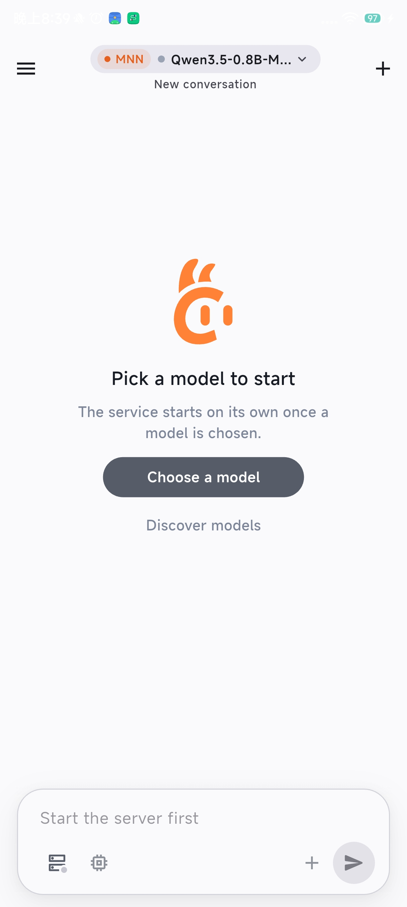
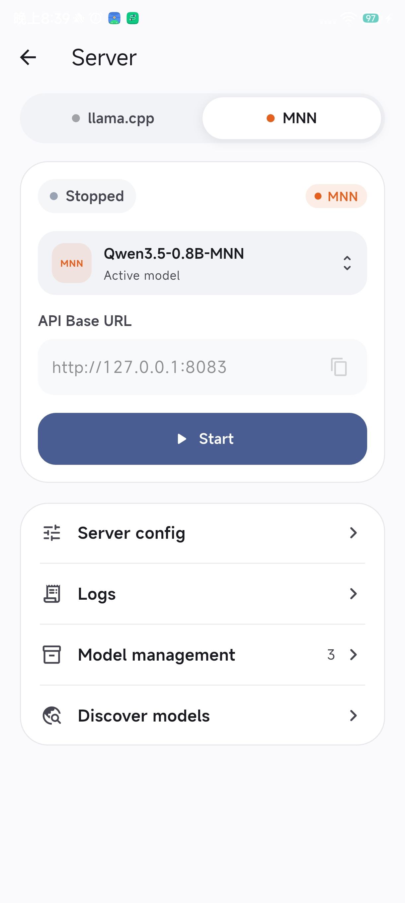
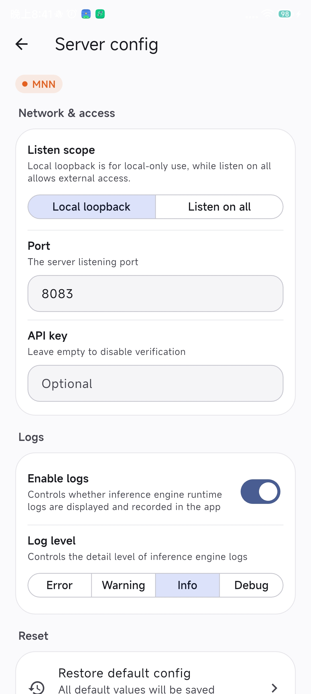
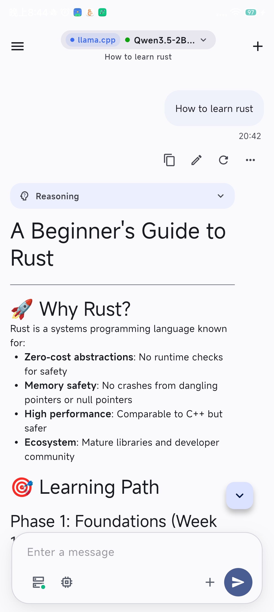

<div align="center">
  
  <h1>ServLlama</h1>
  <p><strong>手机上的本地与云端 AI、助手、工具和离线语音平台</strong></p>

  <p>
    <a href="https://github.com/ArkaneFans/Servllama/releases/latest">
      
    </a>
  </p>

<p align="center">
  <a href="./README.md">English</a> |
  <strong>中文</strong>
</p>

<p align="center">
  <table>
    <tr>
      <td></td>
      <td></td>
      <td></td>
      <td></td>
    </tr>
  </table>
</p>

</div>

## 项目简介

ServLlama 2.0 在一个 Android 应用中整合本地/云端聊天、可配置助手、基础 Agent、静态 Skill、远程 MCP、离线转录与语音合成。本地大模型由 llama.cpp 或 MNN 运行，仍可对外提供 OpenAI 兼容服务；语音只在应用内部使用。

当前分支为 **2.0.0-dev.8 开发版本**，尚未发布稳定版。代码与自动化检查已完成，设备、模型和真实供应商验收见[实现报告](docs/2.0/IMPLEMENTATION_REPORT_ZH.md)及[验收指南](docs/2.0/ACCEPTANCE_GUIDE_ZH.md)。上方截图展示的是 1.x 界面；当前[头像与聊天署名说明](docs/2.0/CHAT_IDENTITY_ZH.md)包含真机界面。

## 核心功能

- 聊天、助手、语音、模型、设置五个主入口。
- 本地用户档案与助手设置，按字段决定助手能使用哪些资料；不需要账号或云同步。
- 会话归属于助手，并独立保存模型选择；助手默认模型只初始化新会话，详见[会话关系设计](docs/2.0/CONVERSATION_ASSISTANTS_ZH.md)。
- 直接连接 OpenAI 兼容、Anthropic、Gemini 供应商，凭据使用安全存储。
- 有限 Agent 循环、逐次工具审批、会话文件、执行回执、静态 Skill 导入，以及 Streamable HTTP / 旧 SSE 远程 MCP。
- sherpa-onnx 与 CrispASR 双引擎离线语音：录音/导入、转录编辑、TXT/有原生时间戳时的 SRT 导出、合成/播放/WAV 导出，以及兼容模型的参考音色。
- 双推理引擎：使用 [llama.cpp](https://github.com/ggml-org/llama.cpp) 运行 GGUF 模型，或使用 [MNN](https://github.com/alibaba/MNN) 运行 MNN 模型。
- 应用内发现模型：浏览精选模型，或同时搜索 Hugging Face 与魔搭 ModelScope。
- 稳定的下载管理：下载 GGUF / MNN 模型，支持暂停、继续、重试、换源，并在页面或应用状态变化后保留任务。
- OpenAI API 兼容服务：核心支持 `GET /v1/models` 和 `POST /v1/chat/completions`，包含流式响应与可选的 API Key 认证，并可在后台保持服务（如进入后台后服务断开，请查看使用注意事项）。
- 完整聊天体验：流式输出、推理内容折叠、Markdown 与代码块、兼容视觉模型的图片输入、消息编辑与重新生成、会话历史和搜索。
- 实用的服务控制：切换仅本机或局域网访问，配置端口与 API Key，调整 llama.cpp 推理参数，并查看、筛选、复制或导出日志。
- Android 系统集成：前台服务通知、亮色与暗色主题，以及中英文界面。

## 推理引擎

| 引擎 | 模型格式 | 兼容性 / 生态 |
| --- | --- | --- |
| llama.cpp | 单个 `.gguf` 文件；视觉模型可附加 `mmproj` 文件 | GGUF 是社区最通用的模型分发格式，Hugging Face 上的主流开源模型几乎都有现成的量化版本，可选范围广。 |
| MNN | MNN 模型 | 由阿里巴巴开源并持续维护，针对移动端 ARM CPU / GPU 深度优化，性能表现出色；模型需经 MNN 转换工具导出后使用。 |

两种 LLM 引擎均需在启动前选定模型。LLM 与语音分别管理驻留，可同时运行；ASR/TTS 共用一条语音队列。语音不会停止本地聊天或已发布的 LLM 服务。两种 LLM 引擎都提供上述核心接口，llama-server 的其他专有功能仅在 llama.cpp 运行时可用。

当前语音配方覆盖 sherpa Whisper、sherpa VITS、Crisp Whisper、Crisp Qwen3-TTS Base。下载、离线导入、依赖文件与许可状态见[语音模型包说明](docs/2.0/SPEECH_MODEL_PACKAGES_ZH.md)。ASR/TTS 不提供对外 HTTP API。

GGUF 模型下载卡片中的「视觉」入口可开关视觉并选择随模型下载的投影器。下载后，可在模型设置中打开原仓库、下载和删除投影器版本，并从已下载版本中选择一个使用。关闭视觉会保留文件；删除当前版本时会选用其他已下载版本，删空后自动关闭视觉。本地导入的模型可手动导入匹配的投影器，并单独开关视觉功能。

## 系统要求

- Android 9（API 28）及以上
- 64 位 ARM 设备（`arm64-v8a`）
- 足够容纳并运行所选模型的存储空间和内存

实际速度和内存占用取决于模型、量化方式、上下文长度和设备性能。如果不确定设备能力，建议先从体积较小的模型开始。

## 快速开始

1. 按下方说明构建此开发版。[GitHub Releases](https://github.com/ArkaneFans/Servllama/releases/latest) 提供已发布版本，本次本地 2.0 分支尚未发布。
2. 本地聊天先在“模型”下载/导入 GGUF 或 MNN；云端聊天先在“设置”添加 AI 连接。
3. 选择助手，再为当前会话选模型开始聊天；助手可设置新会话默认模型。按需启用具体工具和 Skill。
4. 转录/合成先安装对应语音模型包，再进入“语音”。聊天麦克风的转录结果经确认填入草稿，不会自动发送。
5. 需要对外服务时，在“设置 → 服务中心”启动 LLM；供其他设备访问需选择 **监听所有** 并设置 API Key。

默认发布地址为 `http://127.0.0.1:8080`，只能由当前 Android 设备访问。应用内部本地聊天使用独立私用端点。

## API 使用

先通过 `/v1/models` 获取模型 ID，再用于聊天请求：

```bash
curl http://<设备IP>:8080/v1/models
```

```bash
curl -N http://<设备IP>:8080/v1/chat/completions \
  -H "Content-Type: application/json" \
  -d '{
    "model": "模型ID",
    "messages": [{"role": "user", "content": "你好"}],
    "stream": true
  }'
```

如果配置了 API Key，请添加 `-H "Authorization: Bearer <API-Key>"`。本机客户端可将 `<设备IP>` 替换为 `127.0.0.1`。

## 从源码构建

本轮验证环境为 Flutter 3.35.2 / Dart 3.9.0、Android SDK、JDK 17、NDK 27.0.12077973。使用[验收指南](docs/2.0/ACCEPTANCE_GUIDE_ZH.md)中的同层应用/插件目录；尚未发布的 mnn_engine 0.2.0 必须通过本机覆盖引用相邻插件，当前不能仅从公开依赖直接解析。

```bash
flutter pub get
flutter gen-l10n
flutter analyze --no-pub
flutter test --no-pub
# 按下文准备原生库后：
flutter build apk --release --no-pub --target-platform android-arm64
```

MNN 原生产物由相邻 `mnn_engine` 插件提供。llama-server 是预编译的骁龙包（CPU 多变体 + OpenCL + Hexagon），**不进入 git**。构建 APK 前请把 `.so` 复制到 `android/app/src/main/jniLibs/arm64-v8a/`，来源可以是 Release 附件、GitHub Actions 产物或本机 WSL 编译产物。详见 `patches/llama.cpp/README.md`。

运行 `pwsh -File tool/build_speech_native.ps1 -AndroidSdk <SDK路径>` 构建固定版本 Crisp 原生库，sherpa 库由固定 pub 依赖提供。Gradle 校验 Crisp 清单哈希；成品运行 `python tool/verify_android_bundle.py <APK路径>`，并核对版本和签名。未配置 `android/key.properties` 时 Release 使用 Debug 证书。模型权重独立于 APK。

开发验证可运行 `flutter analyze` 和 `flutter test`。

GitHub 工作流 `.github/workflows/build-llama-server-android.yml` 负责编这个包。它检出指定的 llama.cpp tag，应用 `patches/llama.cpp/0001-hexagon-skip-unsupported-devices.patch`，并在 `ghcr.io/snapdragon-toolchain/arm64-android:v0.7` 中编译 CPU 多变体、OpenCL 和 Hexagon。补丁对应 v0.4.1；其它 tag 如果补丁打不上，任务会失败。

## 使用注意事项

- 监听所有网络接口会将服务暴露给当前 Wi-Fi、热点和 VPN 网络。请设置 API Key，并仅在可信网络中使用。
- 部分 Android 厂商会限制长时间后台运行。如果应用进入后台后 API 停止响应，请允许 ServLlama 自启动和后台运行，并关闭对应的电池优化。
- 模型可能占用数 GB 存储和内存，请选择适合当前设备的模型。

## 相关项目

- [llama.cpp](https://github.com/ggml-org/llama.cpp)
- [MNN](https://github.com/alibaba/MNN)
- [mnn_engine](https://pub.dev/packages/mnn_engine)
- [sherpa-onnx](https://github.com/k2-fsa/sherpa-onnx)
- [CrispASR](https://github.com/CrispStrobe/CrispASR)

## 开源许可

ServLlama 基于 [GNU Affero General Public License v3.0](LICENSE) 发布。

---
致谢 [`Linux DO Community`](https://linux.do/).
