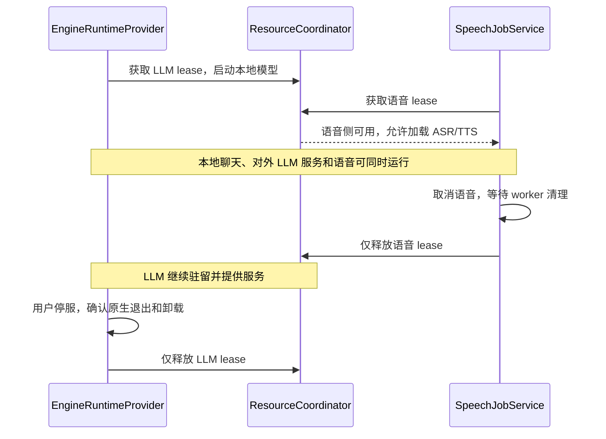

# 2.0 HTTP 取消与本地资源释放设计

2026-09-27 · 方案 1.3。适用于 ServLlama 2.0.0-dev.3+17 与 mnn_engine 0.2.0-dev.2。沿用 1.2 的统一 HTTP 取消方案，按用户确认将 LLM 与语音改为独立驻留。

## 1. 统一的边界

聊天客户端统一通过 HTTP 使用本地 MNN、llama-server 与云端供应商。停止当前回答只取消当前 Run 的 HTTP 请求、工具等待及后续回合；不调用 MNN 的生成接口，不停止整个本地服务。

| 所有者 | 负责的事情 | 完成的含义 |
|---|---|---|
| ChatRunner / ChatProtocolClient | 一个 CancelToken 管当前 Run 的 HTTP 与工具循环，保留已收到的部分结果 | 客户端停止接收、续答和执行新工具 |
| MNN HTTP 服务 | 发现 HTTP 协程取消或响应写失败后，停止本请求拥有的原生生成 | 原生 worker 返回后才能放开请求准入、清理本请求媒体 |
| EngineRuntimeProvider / 引擎适配器 | 停服、确认退出、卸载本地模型 | hasResources 为 false 后才释放 LLM lease |
| ResourceCoordinator | 分别持有 LLM 与语音 lease，ASR/TTS 共用语音侧 | 两侧可同时驻留；同一侧确认释放后才能换模型 |
| 云端 / llama-server | 按各自 HTTP 服务语义处理断开 | 客户端取消不承诺供应商立即停止计算或计费 |

不再发送 X-ServLlama-Request-Id，删除插件公开的 cancelRequest / isRequestActive 和客户端轮询。服务端 UUID 仅用于内部请求归属、日志和媒体目录。Run ID 与工具 call ID 继续承担记录与协议职责。

保留 cancelGeneration：它只向当前原生生成发出停止信号，不关闭服务，也不是原生退出确认接口。聊天层不用它补偿某个请求的取消。

## 2. MNN 服务内部实现

基线插件已经有原生取消能力和普通 SSE 写失败检测；本次补的是预填充、工具输出缓冲期间的 HTTP 生命周期绑定。原生 ABI 与 MNN 3.6.1 固定 commit 不变。

与 0.1.1 基线相比：

| 场景 | 原有行为 | 本次变化 |
|---|---|---|
| 普通文本持续流出时断开 | SSE 写失败后，token 回调返回停止标记，已有取消能力 | 保留此能力，统一纳入 HTTP 生命周期；这不是新增能力 |
| 预填充或工具 token 尚在缓冲 | 缺少持续响应写入，可能到下次实际写入才发现断开 | HTTP 协程独立于同步 JNI，通过 SSE 注释心跳提供写入机会，发现失败后发停止信号 |
| 非流式生成 | 等待同步 JNI，取消 HTTP 协程本身无法中断该调用 | 能观察到协程取消时，显式通知原生；不改变单个 JSON 响应格式 |
| 停服与 LLM 换模 | 发送原生取消并等待 CIO，随后清空服务引用；没有独立确认 JNI 已退出 | 显式等待原生退出，超时保留 LLM 所有权；应用确认卸载后才能换 LLM 模型，语音独立运行 |

相对初版 2.0-dev.1，还移除了客户端私有请求 ID、公开按 ID 取消及状态轮询。现有 cancelGeneration 继续作为底层停止信号，不新增原生取消 ABI。

1. 一个 MnnRequestGate 同时只接纳一个请求。忙时仍返回 HTTP 429，保留已有错误码 request_queue_full 以兼容客户端；没有等待队列，也没有“取消尚未入队 ID”的缓存。
2. JNI 在 IO worker 同步运行，HTTP 协程负责输出。16 个 token 片段的有界通道只用于流式背压，不存放生成请求。
3. SSE 使用协程字节写入，每约 1 秒发送一次注释心跳。心跳按经过时间触发；即使工具 token 持续产生但尚未对外输出，也不会被无限推迟。解析器忽略注释，不产生聊天正文或额外 token。
4. HTTP 协程取消或写入失败时，门控核对内部请求归属、幂等地标记取消，再调用已有原生取消。随后解除通道等待，并在不可取消的清理段等待 JNI worker 返回。
5. 等原生调用返回后，才释放准入和媒体。重复或迟到的取消/释放不能作用于下一请求；原生 reset 与取消仍遵守原有 runtime 锁顺序。
6. stopServer 关闭准入、标记服务停止中并发出取消，执行 CIO 停止与原生请求结束确认。CIO 最多等待 5 秒，随后门控最多再等 5 秒；超时抛 server_stop_timeout，保留所有权，禁止重新启动或卸载。原生 reset/cancel 自身耗时不包含在这两个等待窗口内。

成功 stopServer 只证明已接纳请求结束和 HTTP 服务停止，模型仍需 unloadModel。Service 销毁也不得绕过原生生成中的卸载保护。

## 3. HTTP 取消的实际保证

TCP FIN 可能只是合法的发送方向半关闭，客户端仍可等待响应；它不是“原生已经退出”的凭据。CIO 能观察到的连接重置、协程取消、SSE 写失败会触发上述取消。心跳有助于及时发现写入端失效，但网络栈、代理缓冲和原生批次边界决定实际时延，不提供固定毫秒保证。

非流式请求保留原来的单个 JSON 响应和 HTTP 错误码，不插入心跳或提前发送 200。活动连接上的 TCP reset 可取消其等待协程；仅 FIN、网络静默中断或不再读取的客户端，可能到响应写入时才能被识别。应用聊天始终使用 SSE。真机必须验证 Dio 在目标 Android 网络栈上的实际断开行为。

客户端停止后立即重发，如果前一个 MNN 原生调用尚未退出，新请求可以得到 429。这反映真实资源状态；不增加自动重放队列，也不让新请求抢占前一个调用。

## 4. LLM 与语音独立驻留

应用适配器区分 isRunning 与 hasResources。MNN 的后者包括驻留模型、加载/生成/卸载中的状态和未确认的清理；llama.cpp 以实际子进程退出为准，不在停止异常时丢掉进程引用。启动失败后的清理也遵守同一规则。

语音任务不读取 LLM 发布状态或聊天运行状态，也不请求停止服务、取消聊天或卸载 LLM。反向启动 LLM 不等待语音任务。两种 LLM 引擎仍共享一个 LLM 槽；ASR/TTS 由既有语音 FIFO 串行执行，任务结束后释放语音模型。共享内存、CPU 和设备温度会影响性能，但不是强制串行的依据。

取消尚未完成的启动或换模时，运行时保持 stopping 和原 lease，等待适配器取消与原操作均结束后再检查资源；取消方法抛错也必须等待。通知权限、设置读取、引擎准备完成后均复核操作是否仍有效，避免迟到的准备流程重新进入 start。等待复用现有编排器的一次完成通知，不另建任务调度层。

LLM 清理失败时显示错误并保留“停止”操作，用户可重试；禁止启动下一 LLM 或切换 LLM 引擎，语音侧不受此占用限制。语音清理无法确认时只隔离语音侧，任务、模型和音色删除继续核对该语音 lease；LLM 可继续使用。dev.36 已移除应用层 thermal/trim-memory 启动拦截，停止并确认释放后可立即启动下一模型，不再等待压力标记复查。

没有增加新的调度器、公开取消状态模型或请求注册中心。仍是一个 ChatRunner、一个记录两侧驻留的 ResourceCoordinator、一条语音 FIFO；发布状态只由 EngineRuntimeProvider 管理。

## 5. 验证与验收

自动化覆盖三协议在响应头前及 SSE 中的 HTTP 取消、无私有请求头；MNN 实际 CIO TCP 连接的 prefill/工具缓冲取消、持续心跳、半关闭响应、忙时 429、迟到取消隔离、停服等待及超时重试；应用在启动、换模、卸载未结束或清理失败时保留对应 lease，并验证 LLM/语音并行、相互取消隔离和同侧清理保护。

JNI 在 JVM 测试中使用可控制的同步阻塞替身，证明调度、归属和等待次序，不能证明某个 CPU/GPU 驱动何时响应。具体检查结果见[实现报告](IMPLEMENTATION_REPORT_ZH.md)，真机用例见[验收指南](ACCEPTANCE_GUIDE_ZH.md)的 R05、R09–R14。真实 ASR/TTS 模型、首次 GPU 调优和供应商取消行为仍分别验收。
