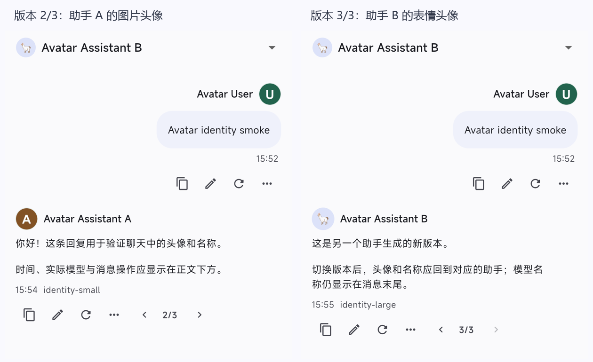

# 用户、助手头像与聊天署名

会话关系在 dev.8 改为[会话绑定助手、模型独立选择](CONVERSATION_ASSISTANTS_ZH.md)。侧栏底部切换助手进入新会话；在原会话改用另一助手需使用“更换此会话的助手”。下文 dev.7 真机记录为历史验证记录。

## 设计

用户与助手都能选择本地图片、表情或恢复默认头像。用户入口在「设置 → 用户档案」，助手入口在助手编辑页；设置页、助手列表、聊天助手选择器与消息区共用头像组件。修改先停留在编辑草稿，保存才生效，返回取消不改变原配置。

参考 Kelivo 的头像与名称行，ServLlama 固定显示实际助手身份：助手消息顶部为「助手头像 + 助手名称」，用户消息顶部为右对齐的「用户名称 + 用户头像」。正文、图片与推理区保持原有能力；时间、实际生成模型、进行中状态统一放在消息末尾，随后是消息操作与版本切换。长名称与模型名必须适应窄屏和大字体。

每条助手消息及其版本保存生成助手的 ID 与名称。显示时优先读取该 ID 对应助手的当前名称和头像，因此改名、换头像能同步反映到历史记录；切换当前助手不会把其他助手的消息改成自己的署名。助手删除后保留消息中保存的名称，头像回退为名称首字。没有身份信息的旧消息显示通用「助手」，不猜测其作者；已有 2.0 Run 的历史可从原快照恢复身份。用户消息使用当前本地档案，未填写名称时显示「用户」。

自 dev.9 起，删除助手会一并删除仍归属于它的会话与草稿；上面的作者回退适用于已转给其他助手的保留会话，以及既有缺失作者记录。不会因为历史消息的作者被删除而删除整个已转移会话。当前规则见[会话关系设计](CONVERSATION_ASSISTANTS_ZH.md)；本文件 dev.7 的删除验收记录保留为历史证据。

头像采用本地小图：选择图片后取静态首帧、居中裁剪为 128×128 PNG，限制输入与解码尺寸，保存有界内联图片值。沿用用户档案 Preferences 与助手 JSON，不新增头像数据库、文件仓库或清理调度器。取消编辑、复制助手、替换头像和删除助手均由原配置生命周期覆盖，业务目录不保存原始照片；系统文件选择器的临时缓存沿用插件生命周期。

头像图片只存于档案/助手配置，不复制进每个消息 checkpoint 或 Run 快照。消息仅保存简短署名；不保留已删除助手的图片历史。名称、头像都是显示数据，不增加模型提示词或图片附件，不写入日志正文，也不会因显示头像自动访问网络。

## 实现

| 范围 | 实现与边界 |
|---|---|
| 头像数据 | [AvatarData](../../lib/features/assistants/models/avatar_data.dart) 接受短文本或有界 PNG data URI；沿用 UserProfile.avatar，新增 Assistant.avatar，旧助手默认空值 |
| 图片处理 | [AvatarImageService](../../lib/features/assistants/services/avatar_image_service.dart) 使用现有 file_picker / dart:ui；原文件最多 10 MiB、单边最多 8192 像素、最多 3200 万像素；缩小解码后居中裁剪，PNG 最多 72 KiB |
| 编辑与显示 | [AvatarEditor](../../lib/features/assistants/widgets/avatar_editor.dart) 管理图片选择和表情对话框；父页面持有草稿，处理图片时禁用保存。[IdentityAvatar](../../lib/features/assistants/widgets/identity_avatar.dart) 只在头像值变化时解析图片，流式正文更新不重复解码 |
| 署名 | [MessageAuthor](../../lib/features/chat/models/message_author.dart) 只有 assistantId/name；[ChatRunner](../../lib/features/chat/controllers/chat_runner.dart) 从本次 Run 配置取得身份，覆盖重生成草稿旧作者，错误消息也保留署名 |
| 版本与恢复 | [消息 JSON 编解码](../../lib/features/chat/repositories/chat_record_codec.dart) 保存 author；人工编辑保留作者、清除旧 Run 续用资格；选择版本恢复该版本作者，空作者会明确清空。checkpoint 和中断恢复保留作者 |
| 历史兼容 | [ChatSessionRepository](../../lib/features/chat/repositories/chat_session_repository.dart) 仅对缺少 author 且带 runId 的记录，从旧 Run 的 assistant 快照补充身份；读取不改写不可变版本，重复保存同一旧版本不误报冲突；schema 仍为 4，Hive 仅保留旧导入 |
| 消息呈现 | [ChatMessageList](../../lib/features/chat/widgets/chat_message_list.dart) 增加身份行，沿用原有正文/图片/推理/操作；时间与实际模型用可换行的末尾信息区，纯图片消息也显示时间 |

消息布局：

~~~text
[助手头像] 助手名称                         用户名称 [用户头像]
推理区（按需展开）                                  用户正文/图片
助手正文                                       时间
时间  实际模型  生成状态                       消息操作
消息操作 / 版本切换
~~~

真机界面：同一条回复的两个版本分别由 A、B 生成，当前选择器均为 B。切换版本时署名和末尾模型信息一起恢复。

不提供远程头像 URL、QQ 头像、模型图标自动替换或额外头像资产管理页；也不将头像当作聊天图片发送。数据保存继续使用原仓库与 provider。图片切换/复制/删除不会创建跨实体文件引用，因此无需增加回收器。助手头像不进入 Run 快照，消息署名不参与上下文续用签名；用户昵称与头像不进入选定的用户提示字段。现有 client.profile.saved / client.assistant.saved 日志即可记录保存事件，不增加图片/名称正文日志。

## 验证与验收

应用版本为 2.0.0-dev.7+21。本轮 analyze 无问题，全量 560 项测试通过，较 dev.6 新增 19 项回归。覆盖图片居中裁剪/大小限制、损坏数据回退、选择取消/忙状态、表情保存/取消、助手复制与删除、生成身份冻结、错误署名、版本与编辑、旧 Run 身份恢复及不可变版本比较、中断恢复、模型请求数据隔离、窄屏大字体。测试使用明确的存储/协议替身，实际文件选择器与 Android 保存行为另做真机冒烟。

| 编号 | 操作 | 预期 |
|---|---|---|
| I01 | 用户档案与助手编辑页分别选择图片/表情、保存、重启，再取消一次编辑 | 保存值保留，取消不改变配置；设置、列表、选择器和聊天显示一致 |
| I02 | 输入长名称，用普通、宽/高图片；恢复默认，再选择损坏/超限文件 | 名称不挤坏布局，图片居中裁剪；失败有提示并保留旧头像，处理完成后可再次保存 |
| I03 | A 助手生成回复，明确“更换此会话的助手”为 B，再重生成该回复；切换版本 | 老版本显示 A，新版本显示 B；显示助手身份，实际模型在消息末尾 |
| I04 | 改名/换头像、人工编辑回复、把会话转给 B 后删除 A、查看旧消息 | 配置变化反映到历史；人工编辑不改署名；已转移会话保留，A 的旧消息显示保存名称和首字头像，不显示 B 的身份 |
| I05 | 打开无身份的 1.x 消息、带 Run 的旧 2.0 消息以及中断的重生成 | 未知作者用通用“助手”；可恢复的作者使用对应快照；无输出重生成保留原消息及作者 |
| I06 | 查看用户、助手、纯图片消息、推理展开、复制/编辑/版本操作；使用 360 dp 与大字体 | 头像和名称在头部，时间/模型/生成状态在末尾，原交互可用且不溢出 |

## 真机冒烟

2026-09-27 在已连接的 Redmi K50 Ultra / Android 12 / API 31 / 4 KiB 设备上，同签名覆盖安装 dev.7+21 Debug。实际检查结果：

| 范围 | 实际结果 |
|---|---|
| 图片和表情 | 用户与助手 A 经 MIUI 文件选择器导入图片、保存成功；助手 B 保存表情。持久化图片均为 128×128 PNG，分别为 9143 / 11424 字节 |
| 聊天布局 | 用户显示自己的名称和图片；A/B 各显示对应助手的名称、头像；时间与 identity-small / identity-large 实际模型名在正文末尾 |
| 版本和作者 | A 生成后切换到 B，旧消息仍显示 A；B 重生成后新版本显示 B，选择旧版本恢复 A |
| 冷启动与删除 | 强制停止、冷启动后图片和所选版本署名保留；删除 A 后旧消息保留生成时名称，头像回退为首字 |
| 数据隔离 | 两次实际 HTTP 请求不含头像或显示名称；Run/checkpoint 无头像；应用日志无本轮测试身份正文，进程日志 fatal 标记为 0 |
| 清理 | 删除本轮 1 个会话、2 个助手、1 个连接和 4 个测试图片文件，恢复用户档案及当前助手；停止测试服务、移除 tcp:18890 映射 |

聊天使用本机临时模型服务驱动生成与版本切换，不代替真实云供应商能力验收。测试期间 USB 重连使 adb reverse 映射失效，首次请求出现 Connection refused；重建映射后两次生成成功。损坏/超限图片、取消编辑、历史恢复和大字体等边界主要由自动化覆盖，本轮没有重跑完整硬件矩阵。

清理后逐项比对所有业务表与 Preferences：原有 19 会话、38 消息、13 版本、1 助手、5 模型资产、2 个已完成语音任务及其他业务行全部保留，原配置与草稿没有变化。没有恢复整份数据库或清空用户数据。

本机证据位于忽略目录 .dart_tool/chat-identity-20260927/：tests.log、analyze.log、device-identity-report.json、fixture-events.jsonl、cleanup-report.json 及对应截图。当前 APK 为 build/app/outputs/flutter-apk/app-debug.apk，SHA-256 为 ec0b50c9e8ffa3b4a65312ac6b96bcbc9d5ab4d43ed9e8658b566fecad00815e。完整 2.0 验收范围见[验收指南](ACCEPTANCE_GUIDE_ZH.md)。
