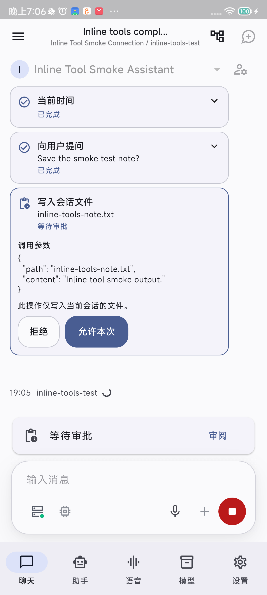
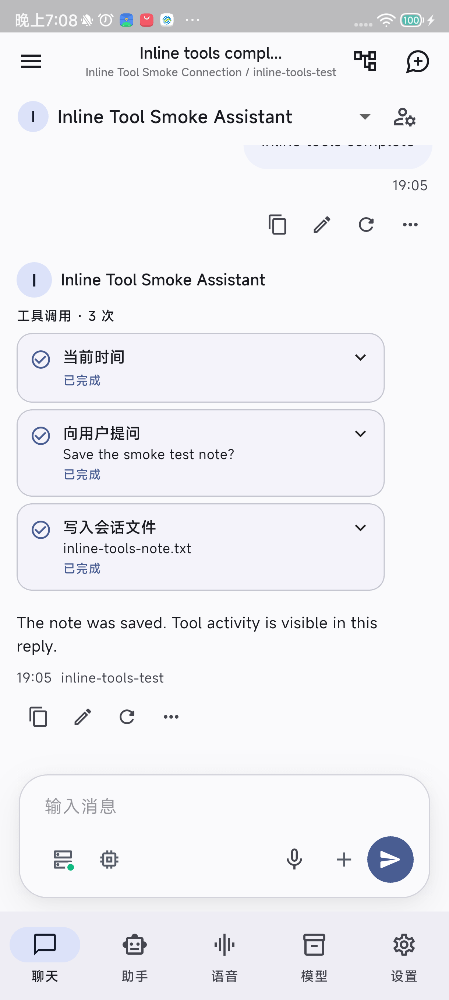
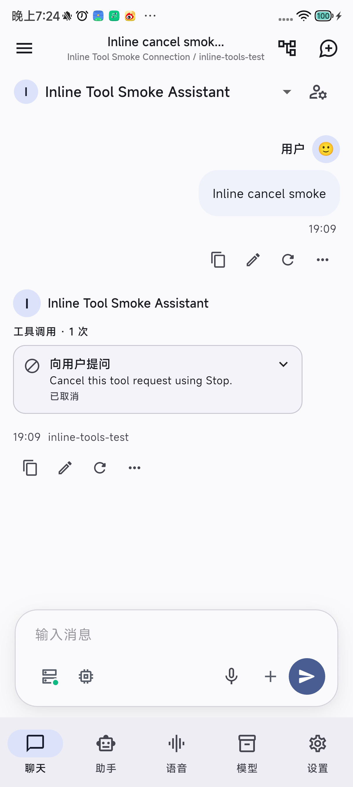

# 聊天中的工具调用过程

适用版本：ServLlama 2.0.0-dev.22+36。工具过程直接显示在对应的助手回复中；会话级“工具调用记录”集中查看所有保留版本的回执。工作区和文本导入已移除，版本删除规则见[消息删除与工作区移除](MESSAGE_DELETION_ZH.md)。下方 dev.10 真机记录与截图作为历史证据保留。

## 交互设计

借鉴 Kelivo 的消息内工具步骤、参数摘要与就地审批，以及 RikkaHub 的状态图标、结果展开与交互式提问。沿用 ServLlama 的 Material 3、消息署名和既有执行链路。

~~~text
助手头像  助手名称
  [思考过程（如有）]
  工具调用 · 3 次
  ✓ 当前时间                     完成，可展开
  ✓ 向用户提问                   完成，可展开回答
  ◷ 远程 MCP 工具                等待审批
    工具名称与服务器名称
    调用参数：本次请求的完整参数
    [拒绝] [允许本次]
  助手的回答正文
  12:34 · 实际模型
~~~

- 在思考块之后、回答正文之前，按执行顺序显示该回复的工具记录。没有调用的回复不显示空工具区。
- 每条记录显示名称、关键参数摘要和文字状态。已结束的记录默认折叠；点击卡片展开参数、结果及错误。长文本在卡片内滚动，可选择复制，不以 Markdown 执行或解释工具内容。
- 等待审批时自动展开参数，直接提供“拒绝 / 允许本次”。远程 MCP 的完整参数可滚动查看。审批期间不能折叠并藏起待审内容。
- `ask_user` 直接显示完整问题与回答输入框，非空回答才能提交，也可拒绝。点击后禁用重复提交；服务端原有状态条件更新仍负责防止重复执行。
- 搜索卡片折叠时显示工具名称与状态图标；展开后显示查询词并复用搜索来源组件，能打开来源链接。dev.22 起移除回执导出；超长结果明确标记截断，不再生成会话文件。MCP 新回执保存实际工具名和服务器名，显示不依赖服务器仍存在；旧回执缺少名称时保留原工具标识。
- 取消、拒绝、失败、结果未知分别显示。结果未知继续提示先核查实际结果，不提供自动重试。输入栏的待审批提示与会话汇总入口仍可作为备用入口。
- 头像、助手名称留在消息头，时间与实际模型留在工具区和正文之后。工具区没有独立的模型或助手身份。

## 数据与组件边界

| 层次 | 职责 |
|---|---|
| `ChatMessageRecord.runId` | 当前选中回复版本的运行身份；与 `sessionId` 一同限定读取范围 |
| `AgentRepository.forRun` | 从现有 `tool_invocations` 表按会话和 Run 查询；按 `created_at,rowid` 排序，毫秒时间相同也保持插入顺序 |
| `AgentToolService` | 沿用执行和审批；现有内存回执列表只保存当前 Run，状态提交后刷新并通知；异步旧会话查询不能覆盖新会话 |
| `ChatToolActivity` | 活跃 Run 订阅服务状态；历史 Run 在组件挂载或活跃会话结束时读取一次；切换版本清除旧数据，加载失败可重试 |
| `ToolInvocationCard` | 聊天与汇总页共用名称、状态、参数/结果展示、审批、提问和搜索来源 |
| `ChatRunner` / `GenerationRunRepository` | 收尾与重启恢复保留已有工具回执但尚无文字的回复，提交其版本，维持可查看入口 |

不新增表、工具执行器、全局历史缓存、轮询器或依赖。普通流式文字更新不触发回执查询。参数和结果的 JSON 展示按回执变化缓存，避免随 token 重复格式化。工具内容、问题与回答继续不进入诊断日志。dev.11 通过现有元数据机制清理旧孤立回执和工作区绑定。

## 历史、取消与恢复

1. 切换回复版本只显示该版本的 Run；不能按会话取最近一次记录代替。其他会话或旧异步查询的结果不会混入。
2. 仅重新表述的版本使用历史回执作为输入，本轮没有执行工具时不显示旧调用为本轮调用。手工编辑产生没有 `runId` 的版本，也不继承旧工具区；保留的旧版本仍能查看自己的记录，删除版本后关联的独占 Run/回执一并清理。
3. 在工具审批前后取消，即使还没有输出文字，也保留空正文的助手回复及工具回执；重新生成时同样保留原版本和新的工具版本。
4. 重启恢复把待审批状态收敛到取消、执行中状态收敛到结果未知，保留关联回复。仅有历史回执不能重新出现有效审批按钮，更不能重新执行。
5. 升级先恢复有效的未完成回复，再清理旧版删除消息后留下的孤立 Run/回执；不在会话汇总中另留档案，不重建已删除消息。删除本版本/全部版本遵循[统一删除事务](MESSAGE_DELETION_ZH.md)。

展示的是现有工具执行链实际保存的记录。模型尚在生成参数时沿用生成提示，进入工具链后显示具体状态；不将未收齐的参数视作已经执行。当前采用有序工具区，不重构正文/思考/工具的跨类型时间线，也不改变上下文、工具预算、MCP 协议或权限。

## 验证与验收

自动化已覆盖：历史顺序与版本隔离、旧异步响应隔离、加载失败重试、流式期间无重复查询、空正文取消、重新生成后的工具版本、仅重新表述不重执行、重启恢复、就地回答与远程 MCP 审批、拒绝/取消、搜索来源、MCP 名称、大结果截断、版本删除，以及窄屏 / 2 倍文字下的状态与操作菜单。

完整分析、测试、真机冒烟与实际界面记录在[实现报告](IMPLEMENTATION_REPORT_ZH.md)和[验收指南](ACCEPTANCE_GUIDE_ZH.md)。

### dev.10 真机冒烟

2026-09-27，Redmi K50 Ultra / Android 12，同签名覆盖安装 `2.0.0-dev.10+24`。通过本机受控 OpenAI 兼容服务返回工具调用，手机执行现有工具和审批链；没有用测试服务代替真实供应商能力验收。

| 流程 | 实际结果 |
|---|---|
| 时间 → 提问 → 写文件 → 续答 | 三条卡片在同一助手回复内依次更新；直接回答并允许写入后全部完成，模型继续回答 |
| 参数与结果 | 待审批时显示待写内容和作用范围；完成后可展开结果，文件内容及回执哈希一致，导出入口可见 |
| 无文字时停止 | 待回答工具变为已取消；空正文助手回复、Run 和一个持久版本保留 |
| 冷启动回看 | 已完成的三条记录可展开；取消卡片仍可见，无可用审批按钮；消息、版本、Run、工具记录逐行不变，服务请求数未增加 |
| 日志与清理 | 61 条对应 Run 的诊断记录未含测试问题、回答、文件路径或正文；冷启动进程日志未见崩溃标记；测试业务数据及临时连接均已清理 |

实际界面（由左至右：就地审批、完成及续答、冷启动后的取消记录）：

| 就地审批 | 工具完成与续答 | 取消记录 |
|---|---|---|
|  |  |  |

USB 重连曾使 `adb reverse` 映射丢失，两个早期尝试出现连接拒绝；恢复映射后完成全链路。测试服务共收到 7 次请求：早期尝试 2 次、完整工具链 4 次、取消流程 1 次。打开历史与展开卡片没有新增请求。没有将早期网络失败标为成功。

删除测试助手经应用级联清理 3 会话、8 消息、4 版本、4 Run、6 条工具回执及其登记文件；随后删除临时连接，停止本机服务并确认端口映射已消失。应用清理登记文件后留下的一个空目录由测试脚本移除。原有 19 会话、42 消息、15 版本、2 助手、5 模型、2 语音任务、2 Run、1 条工具回执和其他业务行、草稿、偏好及元数据全部一致。没有恢复整份旧数据库或覆盖原有数据。

本机证据在 `.dart_tool/chat-tool-activity-20260927/`：`device-report.json`、`after-cleanup-report.json`、`cleanup-resources.json`、`provider-requests.jsonl` 及相应截图。该目录包含设备测试备份，不提交 Git。版本切换、仅重新表述、失败/结果未知、搜索来源、MCP 名称和窄屏大字体由自动化覆盖；本轮未重复真实网络搜索、生产 MCP、原生模型推理或系统导出目的地操作。

当前版本的人工冒烟步骤（dev.11 设备未连接，待验收）：

1. 新建测试助手，开启时间、询问用户工具；需要审批验证时配置受控的远程 MCP，选择支持工具调用的连接。
2. 发起需要工具的请求，确认卡片出现在回复内，状态更新不依赖进入汇总页。
3. 在问题卡片回答，批准受控 MCP 调用后检查完成状态与续答；展开读取参数和结果。
4. 新建会话，让工具等待审批后停止，确认取消卡片与空正文回复保留；冷启动后再次查看。
5. 切换含工具的回复版本、重新表述和编辑版本，确认只显示对应 Run，没有重执行。
6. 网络搜索成功时展开来源、打开链接；失败或结果未知时检查独立提示。外部服务不可达时记录跳过项。
7. 删除本版本或全部版本，核对剩余消息与会话汇总；冷启动后不恢复已删记录。具体步骤见[删除验收](MESSAGE_DELETION_ZH.md#回归与验收)。

## 参考位置

- Kelivo：`lib/features/chat/widgets/chat_message_widget.dart` 中 `_ChainOfThoughtToolStep`，以及 `lib/features/home/services/tool_approval_service.dart` 的会话范围审批。
- RikkaHub：`app/src/main/java/me/rerere/rikkahub/ui/components/message/ChatMessageTools.kt` 与 `tools/ToolUI.kt`。
- ServLlama：[消息工具区](../../lib/features/chat/widgets/chat_tool_activity.dart)、[共用卡片](../../lib/features/agent/widgets/tool_invocation_card.dart)、[现有工具服务](../../lib/features/agent/services/agent_tool_service.dart)。

参考仓库仅用于设计取证，没有复制其时间线框架、渲染器注册表或执行系统。
