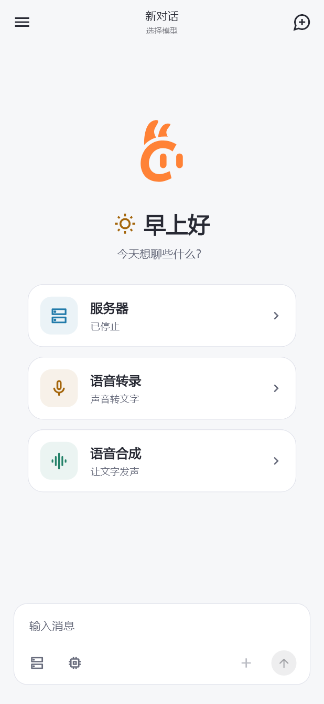
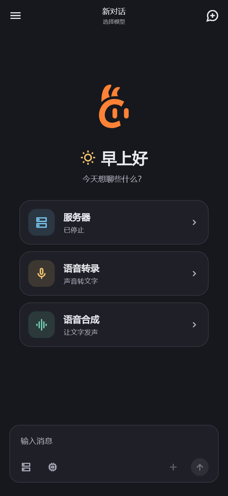
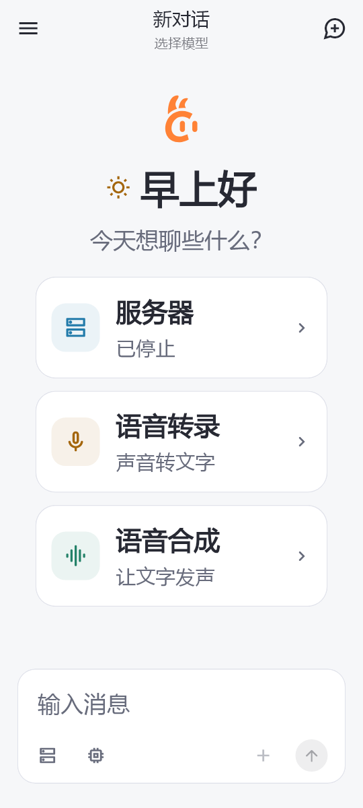
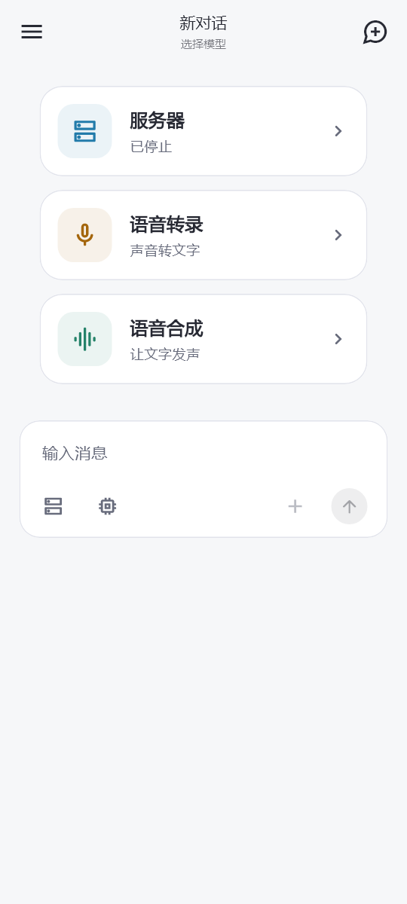

# 聊天欢迎区

版本：2.0.0-dev.32+46，2026-10-06。

## 设计

空白聊天统一显示问候与三个功能入口，适用于新对话、已有空会话、未选模型、本地模型及云端模型。消息加载完成且列表为空才显示，已有消息仍使用原消息列表；缺失助手的旧会话继续保留归属修复入口。

问候按设备本地时间在构建时选择：05:00—10:59 早上好、11:00—13:59 中午好、14:00—17:59 下午好、其余为晚上好。去掉用户称呼及其数据读取。太阳/月亮线性图标放在问候文字前，图标直接着色且没有背景底纹，配合“今天想聊些什么？”，不额外引入时钟服务或后台轮询。

顶部使用既有橙色应用 SVG 图标，下方是 28 dp 问候与辅助文字。参考用户提供的 Agent 应用，以共享主题的白色/深色卡片面、清晰细边框和留白区分层次；服务器、转录、合成分别使用蓝、琥珀、青绿图标与浅色图标底块。强调色只用于入口辨识，不表示引擎或运行状态；应用主色继续采用雾紫。内容最大宽度 480 dp、左右留白 20 dp，整体位于可用区域略偏上的位置。

三个入口为：

- **服务器**：显示当前本地服务简短状态，点击打开 ServerPage；不自动启动，不更改助手模型。
- **语音转录**：直接打开 SpeechPage 的 ASR 标签。
- **语音合成**：直接打开 SpeechPage 的 TTS 标签。

三个卡片固定竖排，卡片内部为图标底块、标题/描述及轻量箭头；卡片随文本自然增高。可用高度小于 420 dp 或字号放大时缩小应用图标、问候和垂直留白，仍保留应用图标；整体可滚动，避免键盘令入口不可达。保留主题按压反馈、无障碍按钮语义及全局导航焦点清理。

## 实现边界

ChatConversationHero 只接收状态、回调与可选测试时间，不读取仓库或启动服务。ChatPage 负责读取现有状态和组装路由。沿用 SpeechPage.initialKind 选择标签，不新增页面或语音调度器。返回保持聊天草稿、会话归属和助手模型，点入口不创建空会话。

移除空会话“远端已就绪”和“下载/选择模型”两套旧 Hero 分支，并移除仅用于旧 Hero 的回调及快照字段。模型选择继续通过输入栏/标题进入，启动进度由现有模型弹窗、运行时标题和服务器状态体现。未选模型发送时依旧提示“请选择模型”。

## 验证与验收

- 本轮 flutter analyze 无问题；聊天、欢迎区、导航与应用页面相关 **48 项回归通过**，最终紧凑布局调整后的 2 项欢迎区测试与实际页面离屏渲染通过。未改业务链路，不重复执行全量业务测试。
- 页面测试覆盖三个路由及语音初始标签、返回保留草稿/模型且不启动服务、不创建会话。
- 覆盖问候时段、应用图标、320×280 短视口/2 倍字号下的滚动与点击；原本地选模启动、空会话与历史跳转继续通过。
- 实际 Flutter 页面离屏检查：明暗主题、360 dp / 1.6 倍字号、键盘占位。截图使用测试状态，字体为本机渲染字体，不是 Android 真机截图；键盘图为向下滚动后验证三个卡片均可访问。
- 当前 ADB 无设备；真机请检查首次打开、切换新对话、键盘开合、三入口跳转返回及正在运行服务的状态展示。无需实际下载、录音或合成即可完成本轮 UI 冒烟。

Debug APK：build/app/outputs/flutter-apk/app-debug.apk；包名 com.arkanefans.servllama，versionName 2.0.0-dev.32，versionCode 46，仅 arm64-v8a。包体 121,903,962 字节；SHA-256：69b47cc68c0a1b89746c490f7ee6d88fb3fc465ee3464f5439f96934f1f60e76。原生库审计、既有 Debug 签名及 ZIP 对齐通过；Release 未重建。

本轮通过 feature/2.0-welcome-visual-refinement 开发并合入本地 feature/2.0，不 push。保留用户 Gradle wrapper 本地配置；未修改插件、上游仓库或依赖。
