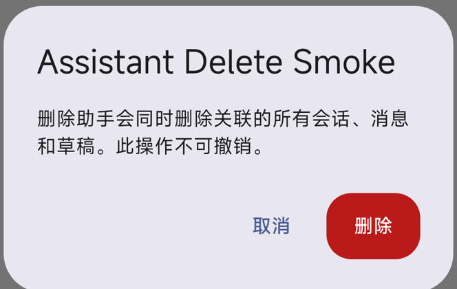
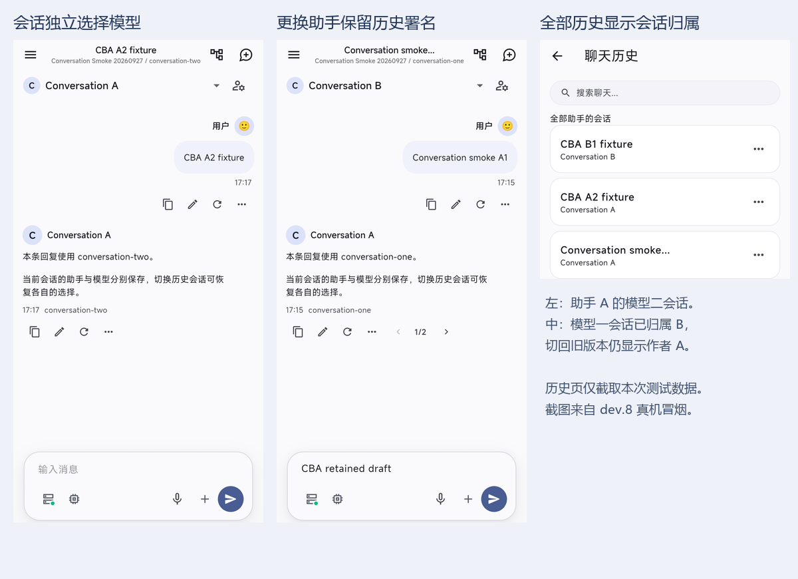

# 会话、助手与模型选择

当前适用版本：2.0.0-dev.30+44。模型选择属于助手，同一助手的会话共用；下方 dev.8/9 验证仅作历史记录，涉及独立会话模型的描述不再适用。

## 功能边界

会话只保存 assistantId；助手保存可空的 chatTarget（本地资产 ID，或供应商 ID + 模型 ID）。聊天选模型更新当前会话所属助手，而非侧栏曾经选择的全局助手。助手仍可自由切换本地/云端模型，不是创建时固定绑定。

| 操作 | 行为 |
|---|---|
| 聊天切换模型 | 修改当前所属助手，同助手所有会话下次生成使用新模型；不会创建空会话 |
| 助手设置选择/清除模型 | 保存后影响此助手所有会话；返回丢弃草稿；选择本地模型不启动服务 |
| 打开历史、新建会话 | 使用所属助手当前模型；不从旧会话、最近选择或运行中的服务回填 |
| 更改会话助手 | 只修改 assistantId，后续生成改用新助手模型；消息、草稿、历史版本不变 |
| 删除供应商、移除模型、禁用供应商 | 原子清空匹配助手的模型选择；保留会话、消息、版本及 Run/工具记录。重新添加或启用后不自动恢复 |
| 删除本地模型 | 提交模型资产缺失状态时清空匹配助手模型；列表刷新同步聊天。停服、暂未启动服务不清空选择 |
| 未选择模型 | 模型入口显示“选择模型”，输入框正常可编辑。发送按钮与键盘发送提示“请选择模型”，保留草稿与附件，不创建消息或 Run |
| 重生成 | 使用当前助手模型；历史版本仍展示实际生成时的助手、模型、工具记录 |
| 删除助手 | 保留现有确认与级联删除；只删除当前属于该助手的会话及草稿，已转移会话不受影响 |

空会话未选模型时使用正常欢迎区（dev.31 起见[聊天欢迎区](CHAT_WELCOME_ZH.md)），不显示供应商丢失错误页；有历史的会话仍正常显示消息。保持雾紫 UI 原语与 AppBar 下方临时消息，不增加修复向导或二次选择层。

## 数据与职责

- Assistant.chatTarget 是唯一当前模型来源。兼容读取既有助手 defaultTarget / 更早 target；明确的空 chatTarget 优先。无效引用在启动或资产刷新时清空。
- ChatSessionRecord 移除 target 字段；conversations.config 只读写 assistantId。旧会话 JSON 中的 target 不再参与选择，普通保存时自然移除；不扫描 Run 推断、不增加表或数据库迁移版本。1.x 导入保持原逻辑，不猜测无归属会话的助手。
- ChatProvider 负责会话选择、发送条件与本地启动编排；AssistantRepository 负责模型选择的最新数据校验、部分更新及删除清理事务。供应商模型列表/删除与助手清理一起提交，失败一起回滚。
- 本地 GGUF 删除沿用 GgufModelStore；MNN 仍由插件删除，之后提交资产缺失及选择清理。若文件已删而 SQL 提交失败，启动/资产刷新会根据现有资产状态恢复清理；不新增文件所有权机制。模型库删除后的应用回调刷新助手数据。
- 助手编辑未修改模型时合并最新模型选择；明确修改模型但该选择已被其他操作改变时提示重开。保存提交校验 revision，且再次校验供应商/模型仍存在，旧页面不能复活已删模型或覆盖较新的选择。
- ChatRunConfig 继续冻结实际助手、连接、凭据与目标。已开始的请求不被模型选择变更改写；供应商删除/禁用、模型移除仍触发现有授权检查与 HTTP 取消。聊天发送、重生成、选模及本地准备继续复用原执行器和互斥条件。
- 本地服务快捷入口只负责启停本地服务，不修改助手模型。私用本地选模可启动，不能静默替换已发布服务；ASR/TTS 资源边界不变。

草稿仍按助手的新会话/已有会话分别隔离，历史模型归属仍保存在消息版本和 Run 快照。未新增模型管理器、会话覆盖层、依赖、HTTP 接口或插件 API。日志事件 client.assistant.model_selected 仅记录助手、连接 ID 与本地标记，不含消息正文、模型密钥。

## 验收步骤

1. 创建助手 A、B；A 选 M1，B 不选模型。给 A 建两个会话。在其中切到 M2，另一个会话及助手设置均显示 M2；B 仍未选择。只选模型不应新增空会话。
2. 从全部历史打开非侧栏偏好助手的会话，切模型只更新该会话所属助手。重启后仍保持这一选择。
3. 将 A 的会话转给 B，模型入口置空；输入文字发送提示“请选择模型”，文字保留。为 B 选 M1 后正常发送，旧消息作者与模型不变。
4. 删除供应商/移除模型/禁用供应商，匹配助手置空，其他助手不受影响；重新添加/启用不会恢复旧选择。已有会话、版本及工具记录可查看。
5. 删除选中的本地 GGUF/MNN 模型后置空；仅停止服务应保留模型，重新选择可启动；有其他已发布模型时不能静默切换。
6. 打开助手编辑页后从其他状态更新/清空模型，保存未改模型的身份信息不得覆盖新选择；旧的明确模型草稿不能复活已删除模型。
7. 用 M1 生成、切 M2 重生成后切换消息版本，实际模型和工具记录按版本显示。生成过程中禁止聊天切模；删除供应商后请求按原取消逻辑收尾。

## dev.30 验证记录

自动化覆盖共享模型、无回退、会话转移、历史 Run/版本、草稿保留、空选择发送反馈、编辑冲突、删除事务回滚、GGUF 旧字段清理，以及原有本地启动/发布保护。全量 722 项测试通过；最终职责整理后 55 项相关回归及 flutter analyze 再次通过。当前无 ADB 设备，真机本地推理、云端调用及覆盖升级由上述步骤验收，本轮不标记已通过。

Debug APK 构建成功，路径 build/app/outputs/flutter-apk/app-debug.apk；manifest：com.arkanefans.servllama、2.0.0-dev.30、versionCode 44、仅 arm64-v8a。包体 121,902,630 字节，SHA-256：a271a0ca927d6efb75d74a0dba1c22008c6c193c018cfade3ccc57fd8e77bd0f。签名验证及原生库审计通过（verify_android_bundle.py 无错误），使用既有 Android Debug 证书。Release 未重建。

本轮在 feature/2.0-assistant-chat-model 开发并本地合入 feature/2.0，不 push；插件、参考项目与依赖未改动。保留并排除用户的 Gradle wrapper 本地配置。

## dev.9 删除助手验证

开发分支为 feature/2.0-assistant-deletion，基于 bb69527；实现提交 18fa987 经 5712c7c 以 merge --no-ff 合入本地 feature/2.0，未 push。版本 2.0.0-dev.9+23，插件与参考仓库未改动。flutter analyze 无问题，flutter test 全量 **590 项通过**，较 dev.8 新增 9 项回归，并替换旧删除语义的用例。

回归覆盖多会话级联、已转移会话及历史作者保留、共享附件/版本与独立语音数据保护、删除末步失败整笔回滚、提交后清理重试、当前会话/草稿恢复、最后一个助手保护、生成期间互斥、旧 draft 键、迟到保存/消息加载，以及窄屏大字体确认/取消界面。证据位于 .dart_tool/assistant-deletion-20260927/。

2026-09-27 在 Redmi K50 Ultra / Android 12 / 4 KiB 页设备覆盖安装 dev.9 后，使用新建测试助手完成冒烟：确认框明确说明影响；取消后两个空会话及三个草稿目标仍在；再次确认后助手、两个会话及全部测试草稿均删除，冷启动不恢复。当前助手自动回到原助手。client.assistant.deleted 记录 conversations=2，日志未含测试名称/草稿正文，进程未见崩溃标记。

删除后与本轮备份逐行核对：原有 19 个会话、38 条消息、13 个版本、2 个助手、5 个模型、2 个已完成语音任务及其他业务记录完全一致，原 Preferences 和原草稿值均保留。回到原助手时新增一个空草稿键，没有新增会话或修改草稿正文；其余元数据不变。测试数据已清理，不曾删除原有助手或恢复整份数据库。

本轮真机只检查空会话和草稿的主流程；消息/版本/附件清理、已转移会话保留、失败回滚、最后一个助手和生成中保护由自动化覆盖。未重复本地/云端 LLM、原生 ASR/TTS、Crisp 或 MCP 推理与调用。

最终 Debug APK 为 121,674,286 字节，SHA-256：626f13c8cd4b580d5adff00fe5435483e10087d358e3c5f6a6a0dc2e4594e197；manifest 为 dev.9 / versionCode 23，arm64-v8a。签名、ZIP 对齐及原生审查通过；Release 未重建。真机结果和数据核对分别见 .dart_tool/assistant-deletion-20260927/device-report.json 与 after-restart-report.json。

## dev.8 历史验证记录

以下保留 dev.8 的实际验收记录，其中“删助手后修复”已由 dev.9 的级联删除行为替代，不作为当前验收预期。

本轮在 feature/2.0-conversation-assistants 实现，版本 2.0.0-dev.8+22。实现提交 bfb1ae0 经 d6cbf00 以 merge --no-ff 合入本地 feature/2.0；未 push。mnn_engine 与参考仓库未改动。

flutter analyze 无问题；flutter test 全量 **581 项通过**。新增的 [conversation_settings_test.dart](../../test/features/chat/conversation_settings_test.dart) 共 21 项，其中 7 项页面测试。覆盖会话/模型恢复、独立默认值、归属更换与重生成、事务失败、写入互斥、发布模型保护、启动加载次序、冷状态与草稿恢复，以及跨助手语音回填和目标删除。已有转录替换冲突、协议、Agent、日志和语音测试也包含在全量结果中。

2026-09-27 在 Redmi K50 Ultra / Android 12 / 4 KiB 页设备完成以下冒烟：

| 检查 | 实际结果 |
|---|---|
| 会话矩阵 | 建立 A / conversation-one、A / conversation-two、B / conversation-one；侧栏按助手筛选，全部历史跨助手恢复正确归属和模型 |
| 可选默认 | A 默认仍为 conversation-one，B 没有默认；两者均可在各自会话中使用模型 |
| 更换归属与版本 | A 的会话明确改归属到 B，保留原模型与文字草稿；重生成后新版本署名 B，旧版本仍署名 A |
| 删除与修复 | 删除 A 后，其另一会话保留 conversation-two 并禁用发送；明确改为 B 后重生成成功。删除连接时显示 3 个会话引用，历史与失效目标保留 |
| 冷启动 | 覆盖安装后原会话的助手、模型、已选版本和文字草稿可恢复；最终构建再次覆盖安装并检查启动 |
| 请求与日志 | 5 次实际 HTTP 流式请求全部完成，模型和助手提示词标记与预期一致；会话日志不含测试提示词/草稿，进程日志未见崩溃标记 |
| 清理核对 | 删除本轮 3 会话、2 助手、1 连接并恢复原偏好；原 19 会话只补齐 config 迁移，38 消息、13 版本、1 助手、5 模型、2 语音任务及其他业务行保持一致，原草稿和 Preferences 保留 |

以下为测试数据的实际界面：左侧是 A 的第二种模型，中间是已归属 B 的会话查看 A 的历史版本，右侧是显示归属的全部历史。

HTTP 使用本机临时 OpenAI 兼容测试服务，通过 adb reverse 连接；这验证应用路由与保存行为，不代替真实云鉴权和模型能力验收。本轮没有重复实际 LLM/ASR/TTS 推理、Crisp、MCP 和完整硬件矩阵。临时服务已停止，tcp:18891 映射已确认移除。

最终 Debug APK 为 121,673,302 字节，SHA-256：3faaaf1e6fb9e23757fc20ed7a21ef6e2f1ec60a41f7d73a4edf7a59f2006919。实际 manifest 为 dev.8 / versionCode 22，arm64-v8a；签名、ZIP 对齐及原生审查通过。现存 Release 仍为旧 dev.4，本轮未重建。

本机证据位于忽略目录 .dart_tool/conversation-assistants-20260927/：analyze.log、tests.log、device-conversation-report.json、cleanup-report.json、final-install-report.json、fixture-events.jsonl 及编号界面截图。完整构建信息与后续清单见[实现报告](IMPLEMENTATION_REPORT_ZH.md#6-已运行验证)和[验收指南](ACCEPTANCE_GUIDE_ZH.md)。
