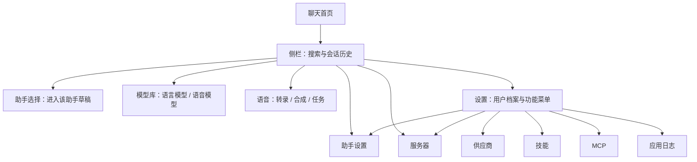
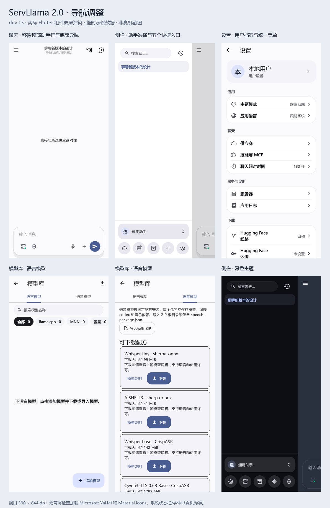

# 侧栏导航、设置与模型库

适用版本：2.0.0-dev.13+27。首页直接进入聊天，移除底部导航和聊天顶部的助手选择行；助手切换与五个功能入口集中在侧栏底部。复用现有页面、Provider 和 Navigator，不增加导航框架或业务状态副本。

本地实现提交 `748b398`，通过 `75dc1e4` 合入 `feature/2.0`，未 push。配套插件保持 `59d5810`。

## 信息架构与交互

侧栏保留搜索、当前助手的会话和全部历史入口。下方依次为带头像与名称的助手选择器，以及「助手设置、服务器、模型库、语音、设置」五个圆形图标。图标保留文字提示和无障碍语义；服务器显示运行状态点，模型库显示活动语言模型下载数量。手机上点功能图标直接打开页面，不先关闭侧栏；返回后侧栏仍展开，保留原聊天和草稿。选择聊天会话时仍收起侧栏。宽屏沿用原可调整宽度的嵌入式侧栏；空间不足时图标自动换行，点击区域至少 48 dp。

助手选择沿用 `ChatProvider.selectAssistant`：进入所选助手的新会话草稿并筛选侧栏历史。生成或会话操作期间禁用切换。侧栏助手设置图标和设置页“助手”菜单打开同一助手列表，可编辑、复制、授权、删除；选择“使用助手”后返回聊天根页面，包括从设置页进入的情况。普通返回只回到上一页。更换已有会话的归属仍从侧栏长按会话的“更换此会话的助手”操作进入，保留明确确认，不把普通切换变成归属变更。聊天模型按钮、启动按钮、录音、新会话和工具记录入口继续可用。

设置页顶部显示本地用户头像与名称，点击进入原用户档案编辑页，保存后立即更新卡片。下面直接展示通用设置列表：主题、语言；助手、供应商、技能、MCP、聊天超时；服务器、应用日志；下载配置和关于。技能与 MCP 是两个独立菜单，分别进入技能管理和 MCP 服务管理页。原 MNN 测试与调试入口放在 Debug 构建的“开发工具”分组。主题和语言继续使用原偏好，供应商和工具权限仍由各自功能管理。

技能页保留 ZIP / Markdown 导入、已安装列表及删除；MCP 页保留服务新增、编辑、删除和编辑页中的工具发现、凭据设置。两页只加载各自目录，沿用 `AgentToolService` 和原数据库，不新增服务或迁移。操作后重新加载目录并刷新助手权限；删除仍通过原服务清理关联授权。加载错误沿用应用错误提示，下拉刷新可重试。助手对技能及 MCP 工具的选择仍在“Agent 权限”中，导入或添加服务不会自动授权。

模型库使用两个标签，默认进入语言模型；从语音页打开时直接选中语音模型。语言模型保留搜索、引擎/能力筛选、下载与导入、设置及删除；语音模型管理已安装与未完成资产、进度、暂停/继续及删除；下载配方移至发现模型，ZIP 页面入口隐藏。语言模型搜索和筛选在标签切换时保留，切到语音后释放搜索输入焦点，点击与左右滑动均可切换。下载管理与发现按钮在两个标签均显示，下载管理分语言/语音两类；语音卡片仍可操作。详见 [模型发现设计](MODEL_DISCOVERY_ZH.md)。聊天模型弹窗、本地供应商和服务器中的模型管理入口均打开同一个模型库。

## 实现与生命周期

| 位置 | 职责 |
|---|---|
| [app.dart](../../lib/app/app.dart) | 应用级依赖、聊天首页、主动初始化语音服务 |
| [main_scaffold.dart](../../lib/app/main_scaffold.dart) | 原侧栏布局、五个功能路由和页面返回 |
| [assistant_selector.dart](../../lib/features/assistants/widgets/assistant_selector.dart) | 助手展示与切换；复用现有会话选择逻辑 |
| [settings_page.dart](../../lib/features/settings/pages/settings_page.dart) | 档案卡片、设置分组与现有功能页入口 |
| [skills_page.dart](../../lib/features/agent/pages/skills_page.dart) | 技能目录、导入及删除 |
| [mcp_servers_page.dart](../../lib/features/agent/pages/mcp_servers_page.dart) | MCP 服务目录及编辑、工具发现；替代原混合管理页 |
| [model_library_page.dart](../../lib/app/model_library_page.dart) | 两个模型标签及下载入口；只做页面组合 |
| [model_management_page.dart](../../lib/features/server/pages/model_management_page.dart) | 使用 Flutter KeepAlive 保留标签内搜索和筛选 |

移除原 `PlatformShell` 和常驻的五页 `IndexedStack`。聊天根页面保留在路由栈中，打开其他页面不会新建 ChatProvider、改变所选会话或清空草稿。返回时重新可见同一聊天。

运行时、下载和语音服务仍属于应用。`SpeechJobService` 显式使用 `lazy: false` 在应用启动时初始化和恢复记录，避免初始化依赖已移除的隐藏语音页；不会因此自动执行中断任务。离开语音或模型页面不取消已提交的任务、下载或本地服务。尚未提交的页面表单按原保存/返回规则处理；本次没有加入新的跨页面表单持久化。

数据库、助手/会话归属、模型资产和 HTTP API 均无迁移。本轮仅修改 ServLlama，mnn_engine 及参考仓库未修改。参考 RikkaHub 工作区 `82c339c1` 的 `ChatDrawer.kt` 底部 AssistantPicker 和 DrawerAction，采用其信息层级，保留 ServLlama 自己的交互与运行时边界。

## 界面检查

以下为实际 Flutter 组件的离屏渲染，使用临时示例数据和 390×844 dp 视口。为了显示文字与图标，测试加载 Microsoft YaHei 和 Material Icons；系统状态栏、系统字体及输入法以 Android 真机为准。这不是原型替图，也不作为真机验证结果。

## 自动化与验收

- `flutter analyze --no-pub` 无问题；全量 655 项 Flutter 测试通过，包含新增 6 项导航交互测试。
- 最后补齐设置值对齐和滑动标签后的焦点释放后，导航、设置、日志的 26 项回归通过；另有 1 项离屏渲染检查，未计入 655 项业务测试。日志位于 `.dart_tool/navigation-20260927/`。
- 回归覆盖五入口往返的会话/模型/草稿保留、助手页“使用助手”返回、用户档案保存、新增设置菜单、模型搜索保留、语音标签直达和活动语音任务保留；包含 360×800 dp、英文 1.6 倍字体、300 dp 键盘，以及 200 dp 宽嵌入侧栏。
- 同时修复设置值、服务器引擎与状态栏、日志级别筛选在窄屏大字体下的横向溢出。浅色与深色侧栏已检查。
- 本轮 ADB 未检测到设备，系统返回手势、输入法、真实下载/模型运行与升级后冷启动仍待真机冒烟。安装包与提交信息见[实现报告](IMPLEMENTATION_REPORT_ZH.md)。

真机只需完成以下主流程，难以提供的模型或网络条件可记录跳过：

| 编号 | 操作 | 预期 |
|---|---|---|
| N01 | 打开应用和侧栏，依次打开五个功能页并返回 | 无底部导航、聊天顶部无助手行；原会话、模型、未发送草稿保留 |
| N02 | 切换助手，再在助手设置中选择“使用助手” | 进入对应助手草稿，侧栏历史随助手切换；已有会话不改归属 |
| N03 | 设置中编辑用户名称/头像，分别查看助手、供应商、技能、MCP、服务器、日志，再返回 | 卡片及时更新；技能/MCP 分别展示各自目录和操作；助手中“使用助手”直接回聊天；其余设置可达 |
| N04 | 模型库输入搜索词，点击及滑动切换两个标签，再返回语言模型 | 搜索/筛选保留，语音标签不保留搜索键盘；下载按钮只出现在语言标签 |
| N05 | 从语音页打开模型库，从服务器和聊天模型弹窗打开模型管理 | 语音入口直达语音标签，其余默认语言标签，返回原入口 |
| N06 | 启动可用的下载或语音任务，返回聊天，再回到对应页面 | 任务持续、状态一致；不因返回停止本地服务；仅使用已有模型即可 |
| N07 | 深色、大字体、键盘、横屏或分屏下操作侧栏与设置 | 五图标可点，列表可滚动，无横向溢出；系统返回行为符合页面层级 |
| N08 | 升级后冷启动，打开助手、历史、两个模型标签及语音任务 | 原资料和业务记录保留，已完成任务可查看，中断任务不自动重放 |

本轮完整范围与其余 2.0 待验收项见[验收指南](ACCEPTANCE_GUIDE_ZH.md)。

## 2026-09-29 功能入口直接跳转

侧栏底部五个功能入口移除跳转前的关闭动画，直接压入页面路由；返回后保持侧栏展开。未改变选择会话时的收起行为。参考本地 Kelivo `side_drawer.dart` 的设置按钮与 RikkaHub `ChatDrawer.kt` 的 `Screen.Setting` 导航，两者均直接打开页面，没有先关闭侧栏。

验证：静态分析无问题，导航与页面回归 11 项通过，覆盖五个功能页打开期间侧栏保持全展开、工具栏返回和系统返回、原会话/模型/草稿保留。

### 真机补验

2026-09-29，在 Redmi K50 Ultra（Android 12）上完成简单 UI 冒烟。源码为 `19fd34d`（包含 `947d814`），通过 Flutter 构建并覆盖安装，保留应用数据；版本仍为 `2.0.0-dev.13+27`。此次安装包已包含侧栏直接跳转改动。

| 检查 | 真机结果 |
|---|---|
| 设置、服务器、语音入口 | 页面正常打开，点击工具栏返回后侧栏保持完全展开 |
| 助手设置、模型库入口 | 页面正常打开，系统返回后侧栏保持完全展开 |
| 设置入口再次进入、系统返回 | 通过；连续截图抽查从展开侧栏进入设置页，采样中未见先收起侧栏的中间状态 |
| 点击已有会话 | 正常进入该会话，侧栏收起，模型选择仍保留 |
| 数据与任务状态 | 原助手及模型列表可见；未启动服务、下载、导入、录音或推理，未修改或删除业务数据 |
| 启动及交互日志 | 本次应用进程的 AndroidRuntime/flutter 日志未发现 FATAL、Unhandled Exception 或布局溢出 |

APK 为 149075977 字节，SHA-256 `a0307be49132f6da1ca7f0c3fbfd76048a1dcdd103fdb3e43d8751ec284883a1`；manifest 版本、签名及原生包审计通过，仅包含 arm64-v8a。沿用既有 Debug 签名，证书 SHA-256 `99c212c1ab3bc814d227d5e60a273c3542d28af5795ad65d0281019d6c5ed1f9`。构建使用缓存 Gradle 8.12，并以 `UI_SMOKE_REV=20260929-sidebar-19fd34d` 刷新 Dart 产物；临时 wrapper 修改已恢复。

截图、UI XML、连续截图采样和日志保存在忽略目录 `.dart_tool/device-ui-20260928/sidebar-*`，不提交包含设备界面内容的原始证据。结束时停留在展开的侧栏，USB 常亮设置恢复原值 `0`。本次未发现需要修复的问题；仅覆盖上述导航流程，未重复模型下载、导入、推理及深色/横屏/大字体验收。

## 2026-09-30 设置菜单拆分

设置页新增“助手”，原“技能与 MCP”替换为“技能”和“MCP”两个独立页面，交互及职责见上文。删除旧混合页面和不再使用的合并标题；MCP 编辑器原有配置、工具发现和保存流程完整保留。“使用助手”会退出设置层级返回聊天，普通返回仍只返回上一页。

静态分析通过，设置、导航、工具授权及首页回归共 30 项通过，包含窄屏大字体菜单往返、目录隔离、技能删除与助手授权刷新、MCP 修改保存/删除后刷新，以及设置中的“使用助手”返回聊天。修正测试中的滚动等待和路由动画推进后复验通过。本次没有构建或安装 APK，也没有执行真实技能导入或远程 MCP 请求；上方真机结果对应此前侧栏改动，未覆盖本次菜单拆分。
