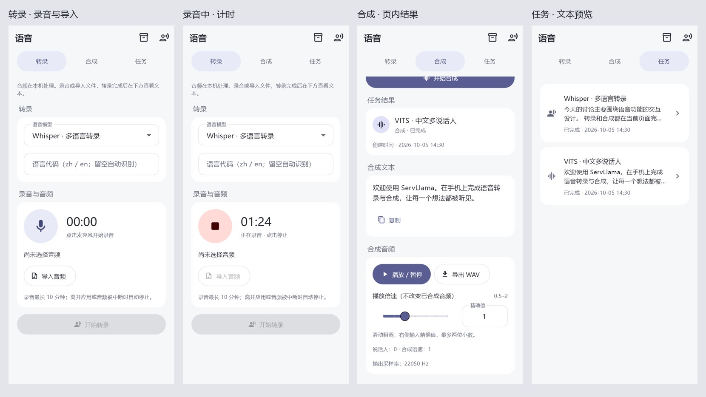
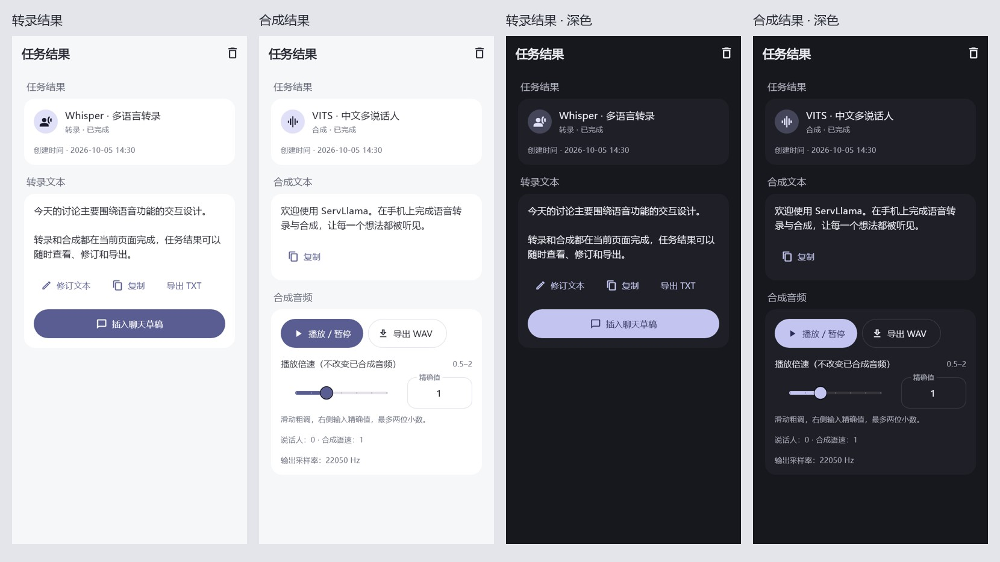
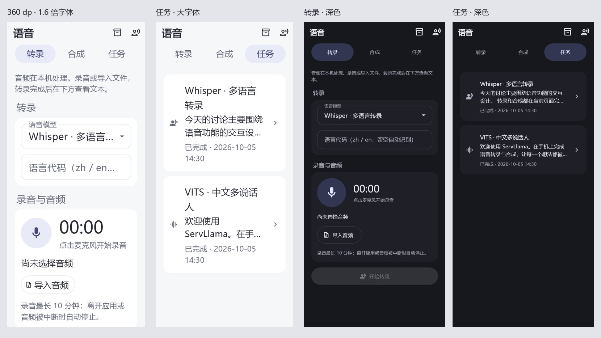

# 语音页内结果与任务展示

版本：2.0.0-dev.29+43。日期：2026-10-05。

dev.29 调整：重新进入语音页时，转录和合成均不自动显示历史结果；当前页面内切换标签继续保留本次任务，历史任务仍在任务列表查看。转录模型/语言配置移到录音区域上方。

## 设计与功能边界

设置页的服务分组增加「语音」，与侧边栏共用 `SpeechPage`。保留转录、合成、任务三个标签，不增加第二套语音导航或任务状态。

转录和合成在当前页提交、等待、取消、重试并查看结果；音色编辑中的「保存并试听」也采用相同行为。只有主动点击任务卡片才进入结果详情。任务仍由应用级 `SpeechJobService` 执行，离开页面不取消已提交任务。语音仍仅供应用内部使用，与本地 LLM 独立驻留。

转录页参考 CrisperWeaver 的大麦克风与计时布局，使用 ServLlama 雾紫主题：

- 上方配置卡：已安装的转录模型与可选语言。
- 下方录音卡：80 dp 圆形麦克风/停止按钮、等宽数字计时、录音状态、音频文件和导入/试听/丢弃操作；不增加实时识别或录音暂停。
- 开始转录后，下方显示任务状态及文本。合成页保留模型适配参数，下方显示本次合成文本和音频操作。
- 采用共享 `SettingsSection.form`、20 dp 页边距、16 dp 间距、自动换行的操作按钮、带精确输入的数值滑块；适配明暗主题和大字体。

计时直接读取音频服务已有的单调时钟，仅计时文本每秒刷新；不通过全局通知每秒重建页面。权限等待/停止阶段禁用录音操作；取消授权后可重试。原有 10 分钟上限、进入后台/音频中断停止、最近录音恢复逻辑保留。重启恢复的录音没有保存时长，不估算为录音计时。

## 结果与数据

| 展示位置 | 内容与行为 |
|---|---|
| 转录/合成页下方 | 当前任务状态、进度、取消、错误与重试；完成后显示文本及可用结果操作 |
| 任务卡片 | 模型名称、两行文本预览、状态、创建日期时间；执行中可取消，点击查看详情 |
| 结果详情 | 模型/任务类型/状态、创建时间、独立文本区；合成额外提供音频播放和导出区 |
| 转录文本 | 优先显示修订文本；支持修订、取消修订、复制、TXT 导出和明确插入聊天草稿；有原生分段时间戳才提供 SRT |
| 合成文本 | 展示任务提交时冻结的文本；修改上方输入不会改写旧任务的文本或音频 |
| 合成音频 | 播放/暂停、WAV 导出、播放倍速和精确值输入；展示说话人、合成语速、参考音色及采样率等有效信息 |

日期时间来自已有 `createdAt`，按设备本地时区显示到分钟，不伪造完成时间。无转录内容时展示明确空状态。任务输入快照不再出现在页面中，但内部冻结的输入、模型版本、音色与权限信息继续保留，供可靠执行和显式重试使用；无数据库迁移、删库或历史记录清理。

## 实现组织

- `speech/widgets/audio_input_panel.dart`：语音页和音色编辑共用录音/导入区；录音权限等待期间页面已销毁时，启动完成后收尾本次录音。
- `speech/widgets/speech_job_widgets.dart`：共享任务卡、文本预览、日期状态、等待说明与 `SpeechJobResult`。页内和详情共用同一结果组件，修订沿用服务层持久化和原生分段时间戳规则。
- `SpeechPage`：每种任务仅保留本次页面提交的 job ID 与提交状态；同一页面内切换标签不丢失结果，退出后重新进入不自动回显旧任务。此规则适用于普通入口、聊天转录和指定朗读入口，不删除历史任务，也不停止已经提交的任务。
- `SpeechJobPage`：负责详情路由与删除；重试在本页替换所展示的 job ID。
- `VoiceProfilesPage`：音色保存试听留在编辑页，使用同一结果组件。

提交成功后展开页内结果并滚动到下方；当前标签提交/执行期间禁用重复提交。重试仍通过服务创建新的任务并保留原任务，不复活旧任务或擅自替换模型。失败保留错误与重试入口；取消遵守原生清理完成后才释放资源的既有规则。转录插入聊天仍需用户明确操作，沿用草稿冲突确认，不自动发送。

## 实际界面

以下来自真实 Flutter 页面离屏渲染，使用测试任务数据；为 Windows 渲染临时加载中文字体，未给应用引入字体依赖。录音状态与结果数据是展示用夹具，截图不代表设备录音或真实模型推理已经验收。

## 冒烟验收

1. 设置 → 语音，确认能打开转录/合成/任务；侧边栏入口仍正常，返回不恢复输入焦点。
2. 转录：选择已下载模型，录音或导入音频。录音中大按钮变停止，计时递增；停止后试听可用。提交后路由不变，下方出现进度，重复提交被禁用。
3. 等待转录完成，检查文本、创建时间、复制与修订；保存修订后，任务卡预览和详情同步更新。测试 TXT；支持原生分段时间戳的模型另测 SRT。聊天插入仍须明确确认。
4. 合成：输入短文本并提交，停留本页；完成后播放/暂停、导出 WAV、调整播放倍速。修改上方输入，旧任务的合成文本保持不变。
5. 音色：使用支持克隆的模型打开音色编辑，点击「保存并试听」，确认编辑页不跳转、不自动关闭，下方显示试听任务和音频结果。
6. 同一语音页内切换标签、进入任务详情再返回，任务继续执行且本次结果可见；退出整个语音页后重新进入，转录/合成页均不显示上次结果，历史记录仍可在任务标签查看。任务失败可在原页重试；取消后能继续提交新任务；检查等待、取消中及错误说明。
7. 任务列表核对 ASR/TTS 文本预览、状态和日期时间；详情有明确文本字段且不显示输入快照；删除终态任务沿用已有任务/文件清理逻辑。
8. 明暗主题、360 dp 窄屏及 1.6 倍字体下检查录音、长文本预览、按钮换行；原生麦克风授权拒绝/重试、切后台与音频中断仍需真机确认。

## dev.28 验证记录

自动化、APK 校验与设备状态见下方交付记录；设备/模型音质、真实耗时和平台音频 I/O 不由离屏检查或假推理工作线程替代。

- `flutter test --no-pub`：716 项通过。新增覆盖转录/合成原页完成、文本修订同步预览、音色原页试听、重试新 ID、取消、标签切换、重复提交限制及录音计时；设置导航用例增加语音入口。
- `flutter analyze --no-pub`：无问题。
- 真实页面离屏检查通过：390 dp 明暗主题、360 dp / 1.6 倍文字；任务详情、文本操作、麦克风与计时、预览卡片无溢出。推理工作线程为测试替身，任务持久化、模型校验、输入复制等沿用实际服务。
- Debug APK 构建通过，实际 manifest 为 `com.arkanefans.servllama` / `2.0.0-dev.28` / versionCode `42`；文件为 `build/app/outputs/flutter-apk/app-debug.apk`，121,899,774 字节。
- APK SHA-256：`4cb95212d910bfc7d21651470171d5032df2d1f40eea5343f7ca0de045af8af7`。
- `apksigner verify --print-certs` 通过；Debug 证书 SHA-256：`99c212c1ab3bc814d227d5e60a273c3542d28af5795ad65d0281019d6c5ed1f9`。
- `tool/verify_android_bundle.py`：通过，仅 `arm64-v8a`，原生库与 DSP 核对通过。
- 本轮 `adb devices -l` 为空；未进行真机安装、麦克风/系统文件选择器、真实 ASR/TTS/克隆、音频播放导出和后台中断测试。按上方步骤补做即可，不将这些项目记为通过。

在本地 `feature/2.0-speech-inline-results` 开发并合入 `feature/2.0`；不 push，不提交 APK/原生库或本机 Gradle 配置。未修改插件、上游参考项目、依赖和数据库结构。

## dev.29 验证记录

- 25 项语音/导航测试通过，复用原用例验证重新进入 ASR/TTS 不回显、历史任务仍可查询、模型选择位于录音区上方；原页重试/取消及标签切换继续通过。
- 静态分析无问题；更新后的转录页在明暗主题与 360 dp / 1.6 倍字体下离屏检查通过。本轮未进行真机验证。
- Debug APK 构建及签名/原生库核验通过；版本 `2.0.0-dev.29`，versionCode `43`，仅 `arm64-v8a`，121,899,846 字节；Debug 证书与 dev.28 相同。
- APK SHA-256：`c6cf10c854a1d5d93fb9b83bd93beb99c6241d6f855513d67f9459f8dc315c94`。路径仍为 `build/app/outputs/flutter-apk/app-debug.apk`，已替换 dev.28 成品。
- 本地分支 `fix/2.0-speech-page-entry` 合入 `feature/2.0`，未 push；本机 Gradle 配置保留，不提交。
